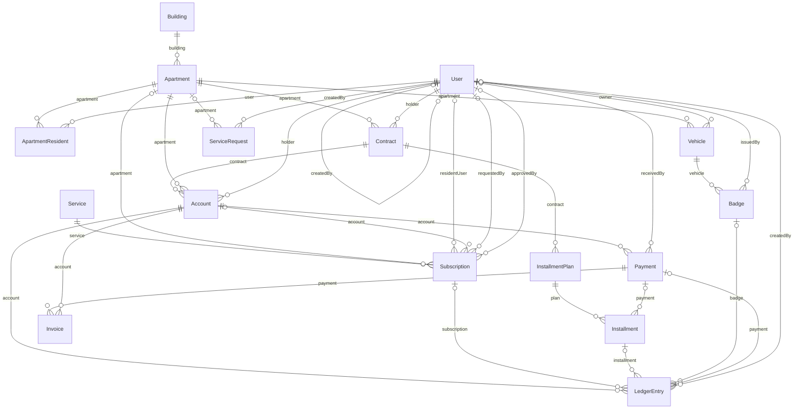
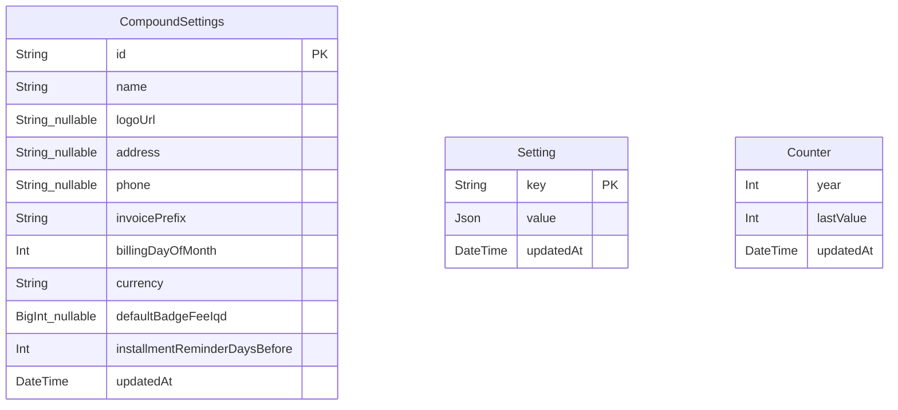
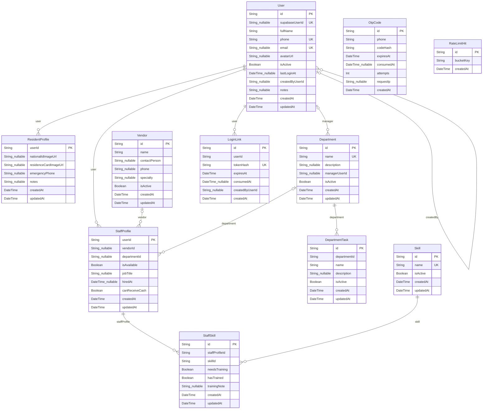
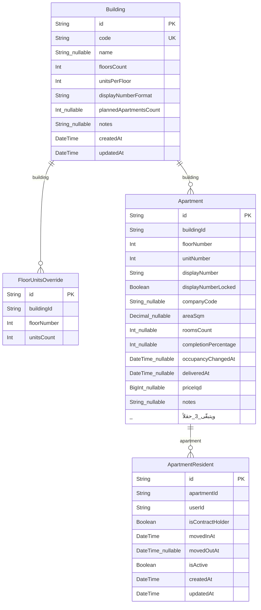
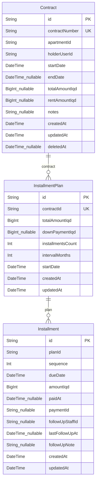
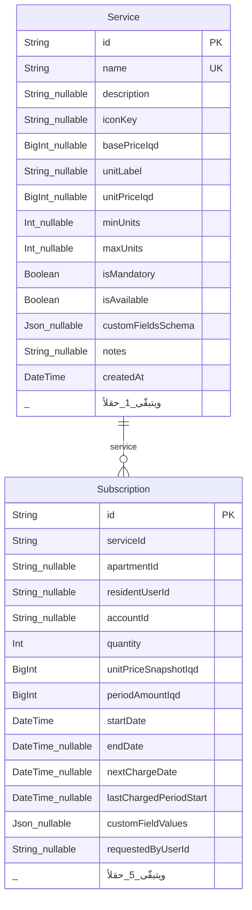
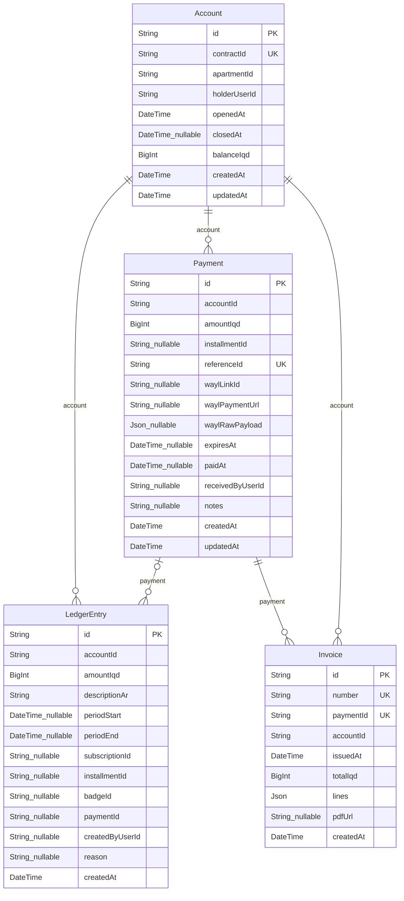
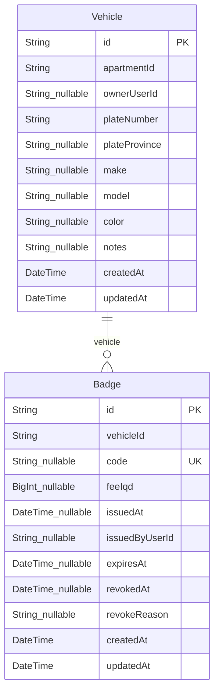
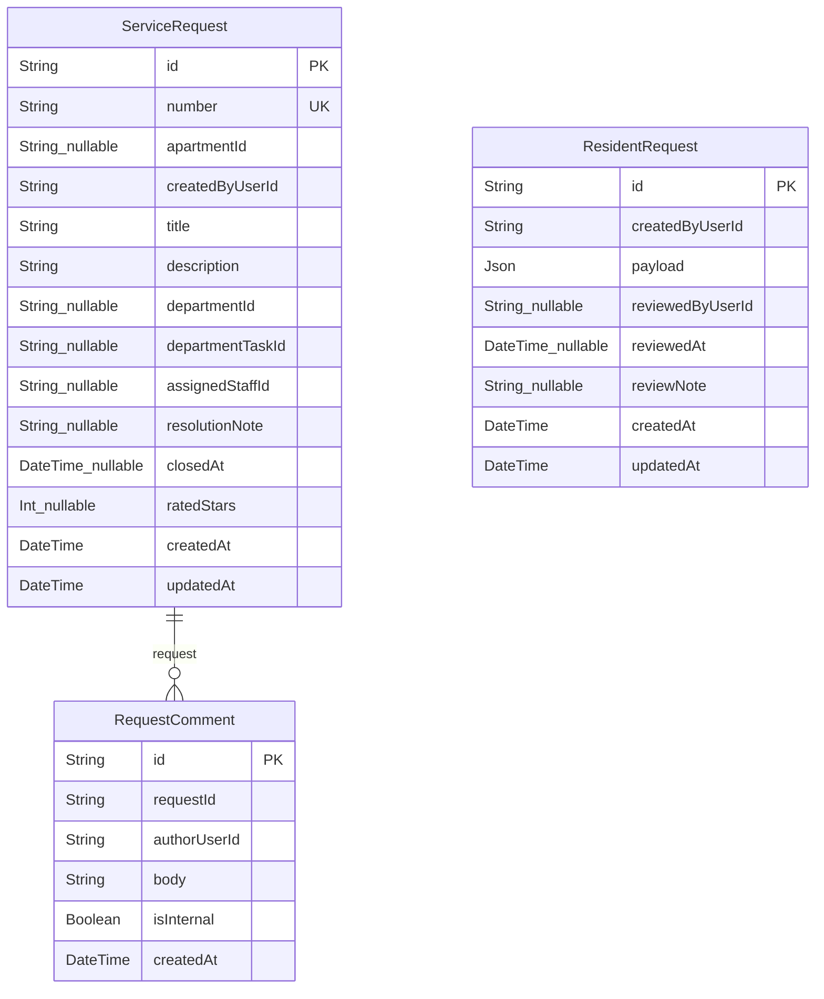
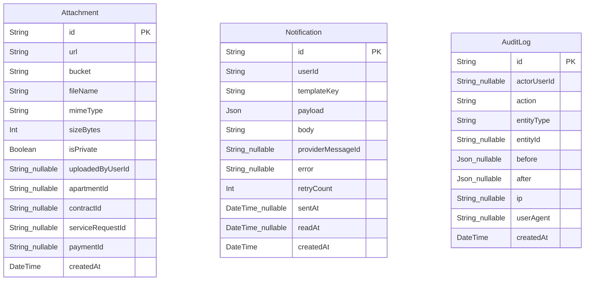

# مخطّط العلاقات

> **مُولَّد من `prisma/schema.prisma`** — لا يُحرَّر بيد. أعد التوليد بـ`npm run erd`.
> **آخر توليد:** 2026-08-24
> **الإحصاء:** 35 جدولاً · 37 نوعاً · 59 علاقة موجَّهة.

## كيف يُقرأ

`A ||--o{ B` تعني: **B يحمل المفتاح الأجنبي** إلى A. الاسم على السهم هو حقل العلاقة.
`|o` بدل `||` تعني أن المفتاح **قابل لـnull** — أي أن الصف قد يوجد بلا هذا الربط، وهذا في حدّ ذاته قرار مجال لا تفصيل تقني.

---

## النظرة العامة — المحاور الأربعة

هذه الكيانات الستة عشر هي ما يجري عليه العمل يومياً. الباقي مرجعي أو عرضي.

**ثلاث حقائق يقولها هذا الرسم وحده:**

1. **`Account` يتدلّى من `Contract` لا من `Apartment`.** هذا المبدأ 3 مرسوماً: مالك جديد أو مستأجر جديد **لا يرث** رصيد سابقه أبداً.
2. **`Apartment` له `Contract` متعدّد.** بعد `S1`/`D1` يجوز عقد بيع وعقد إيجار نشطان معاً — «شقة مباعة يسكنها مستأجر». والفهرس الفريد الجزئي هو ما يمنع الثاني **من نفس النوع**.
3. **`LedgerEntry` يشير إلى أربعة مصادر** (`Subscription` · `Installment` · `Badge` · `Payment`) وكلها **قابلة لـnull** — لأن القيد قد يكون يدوياً أو افتتاحياً بلا أي مصدر منها.

---

## الإعدادات

---

## الهوية والتنظيم

---

## العقار

---

## العقود والأقساط

---

## الخدمات والاشتراكات

---

## المال

---

## الوصول

---

## الطلبات

---

## العرضية

---

## الأنواع المعدودة (37)

- **`UserRole`** — OWNER · ADMIN · STAFF · RESIDENT
- **`Gender`** — MALE · FEMALE
- **`EmploymentType`** — INTERNAL · FREELANCE · VENDOR
- **`SkillLevel`** — BEGINNER · INTERMEDIATE · ADVANCED · EXPERT
- **`NumberingScheme`** — SEQUENTIAL · PER_FLOOR
- **`ConstructionStatus`** — UNDER_CONSTRUCTION · COMPLETED · DELIVERED
- **`OwnershipStatus`** — UNSOLD · SOLD · RENTED_BY_COMPANY
- **`OccupancyStatus`** — VACANT · OCCUPIED_BY_OWNER · OCCUPIED_BY_TENANT
- **`ResidentRelation`** — FAMILY_MEMBER · OTHER
- **`ContractType`** — SALE · RENTAL
- **`ContractStatus`** — DRAFT · ACTIVE · EXPIRED · TERMINATED
- **`PaymentType`** — FULL · INSTALLMENTS
- **`PlanStatus`** — ACTIVE · COMPLETED · CANCELLED
- **`InstallmentStatus`** — PENDING · PAID · OVERDUE · CANCELLED
- **`ServiceBillingType`** — RECURRING · ONE_TIME
- **`BillingCycle`** — MONTHLY · QUARTERLY · YEARLY
- **`PricingModel`** — FLAT · PER_UNIT · PER_PERSON
- **`PayerType`** — OWNER · OCCUPANT
- **`ServiceAppliesTo`** — APARTMENT · RESIDENT · BOTH
- **`SubscriptionSubjectType`** — APARTMENT · RESIDENT
- **`SubscriptionStatus`** — PENDING_APPROVAL · ACTIVE · PAUSED · CANCELLED
- **`AccountStatus`** — OPEN · CLOSED
- **`LedgerEntryType`** — CHARGE · PAYMENT · ADJUSTMENT
- **`LedgerSource`** — SUBSCRIPTION · ONE_TIME_SERVICE · INSTALLMENT · RENT · BADGE · MANUAL · OPENING
- **`PaymentMethod`** — CASH_AT_CENTER · WAYL_LINK
- **`PaymentStatus`** — PENDING · PAID · FAILED · EXPIRED · CANCELLED
- **`VehicleStatus`** — PENDING_APPROVAL · APPROVED · REJECTED · REMOVED
- **`BadgeStatus`** — REQUESTED · ISSUED · REVOKED · EXPIRED
- **`RequestType`** — SERVICE_REQUEST · COMPLAINT
- **`RequestScope`** — APARTMENT · COMMON_AREA
- **`RequestStatus`** — NEW · ASSIGNED · IN_PROGRESS · DONE · CANCELLED
- **`Priority`** — LOW · NORMAL · HIGH
- **`ResidentRequestKind`** — BADGE · SUBSCRIPTION_CANCELLATION · PROFILE_CHANGE
- **`ResidentRequestStatus`** — PENDING · APPROVED · REJECTED
- **`NotificationChannel`** — WHATSAPP · IN_APP
- **`NotificationStatus`** — PENDING · SENT · FAILED
- **`CounterKind`** — INV · CTR · REQ
