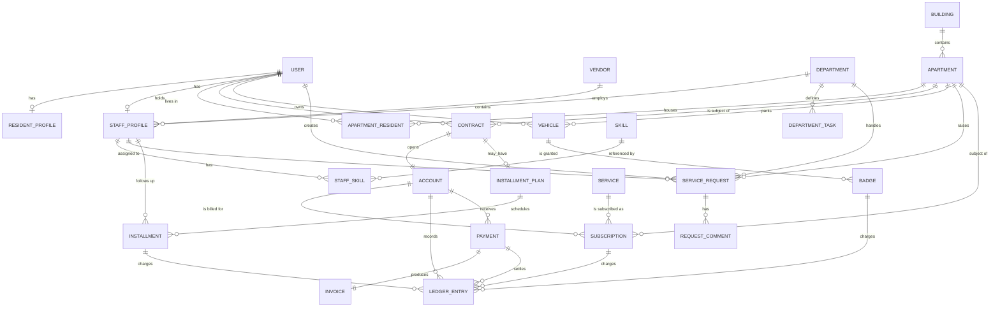

# Residential Compound Management System — Full Technical Specification

> **Purpose of this document:** This is a complete, implementation-ready specification for an AI coding model (or a development team) to build the system end to end. Every entity, field, rule, flow, and integration is defined explicitly. Where a decision was made by the product owner it is marked **[DECIDED]**; where a sensible default was assumed it is marked **[ASSUMPTION]** and repeated in Section 14.
>
> **Language note:** The codebase, database, and this document are in **English**. The **entire user interface is Arabic (RTL) only** — no i18n framework, no language switcher.

---

## Table of Contents

1. Project Overview & Objectives
2. Tech Stack & Architecture Decisions
3. User Roles & Permission Matrix (RBAC)
4. Domain Model — Entity by Entity
5. Full Prisma Schema
6. Entity Relationship Diagram
7. Core Business Flows
8. Feature Breakdown per Dashboard
9. Route & Folder Structure + Server Actions API
10. Authentication & Authorization
11. UI/UX Guidelines (Arabic RTL, shadcn/ui)
12. Non-Functional Requirements & Integrations
13. Implementation Phases
14. Assumptions, Out of Scope & Open Points
15. Glossary (Arabic ↔ English)

---

## 1. Project Overview & Objectives

### 1.1 What the system is

A web application that manages **one single residential compound** (a gated community made of several buildings, each containing floors and apartments). The system is the operational and financial backbone of the compound:

- It keeps the **inventory** of buildings, floors and apartments — including apartments still under construction.
- It keeps the **register of people**: apartment owners, tenants, their family members, and the staff who serve them.
- It manages **services and subscriptions** (generator/amperes, water, internet, cleaning, security, parking, sports facilities, …), which are the commercial core of the business.
- It maintains a **financial ledger per contract** — every charge, every payment, every invoice.
- It tracks **apartment purchase installments**, followed up manually by staff.
- It controls **vehicle access badges** (a car with a badge enters without inspection).
- It runs a **lightweight service-request / complaint workflow** routed to departments and staff.
- It exposes **four dashboards**, one per role, each showing only what that role needs.

### 1.2 Business objectives

| # | Objective |
|---|---|
| O1 | Replace paper/Excel tracking of apartments, residents and subscriptions with one source of truth. |
| O2 | Know at any moment which apartments are sold, empty, occupied by owner, or rented to a tenant — because **occupancy drives billing**. |
| O3 | Know exactly what every contract holder owes and has paid, and produce an invoice for every payment. |
| O4 | Give the compound owner reliable, live financial and occupancy reporting without asking the admin for a report. |
| O5 | Let residents see their own subscriptions, dues, invoices, vehicles/badges, and open requests. |
| O6 | Route resident requests and complaints to the right department and staff member, and track them to closure. |

### 1.3 Guiding product principles

1. **Nothing is stored that can be derived.** Counts (completed apartments, subscribers per service, residents per apartment) are always computed by query, never kept as a manually edited number.
2. **Occupancy is the billing switch.** A `VACANT` apartment accrues no recurring charges. Changing occupancy starts or stops billing, and the change is dated.
3. **The financial ledger follows the contract, not the apartment.** A new owner or tenant never inherits the previous person's balance; the old ledger is closed and archived but stays visible on the apartment's history.
4. **Money is integer IQD.** No floats anywhere. Iraqi Dinar has no minor unit in practice, so amounts are stored as `BigInt` IQD.
5. **Every financial mutation is audited.** Who did it, when, before/after values.

---

## 2. Tech Stack & Architecture Decisions

### 2.1 Stack

| Layer | Choice | Notes |
|---|---|---|
| Framework | **Next.js (latest, App Router)** | Server Components by default; Server Actions for all mutations |
| Language | **TypeScript** (strict mode) | `strict: true`, no `any` in domain code |
| ORM | **Prisma** | Single source of truth for the schema |
| Database | **Supabase Postgres** | Accessed through Prisma over the pooled connection |
| File storage | **Supabase Storage** | Private buckets, RLS applied here only |
| Auth | **Supabase Auth** — Google OAuth **+** phone OTP (custom, via UltraMsg WhatsApp) | See Section 10 |
| Styling | **Tailwind CSS** | RTL-first configuration |
| UI kit | **shadcn/ui** | Components copied into `/components/ui`, RTL-adjusted |
| Forms | **react-hook-form + zod** | One zod schema per action, shared between client and server |
| Tables | **@tanstack/react-table** | Server-side pagination, filtering, sorting |
| Charts | **recharts** | Owner dashboard KPIs |
| Dates | **date-fns** with Gregorian calendar, Arabic locale | Display format `dd/MM/yyyy` |
| Background jobs | **Vercel Cron** (or any scheduler) hitting protected route handlers | Monthly billing, reminders |
| Payments | **Wayl** payment links + webhook | See 12.4 |
| Messaging | **UltraMsg** WhatsApp API | OTP + notifications, see 12.3 |

### 2.2 Data access architecture **[DECIDED]**

- **Prisma is the only path to the database.** All queries and mutations run on the server (Server Components, Server Actions, route handlers).
- **Supabase Row Level Security is NOT relied upon for table data.** Prisma connects with a privileged role and bypasses RLS. Therefore **authorization is enforced in the application layer** — see 2.3.
- **RLS is applied only to Supabase Storage buckets**, so that private files (ID cards, residence cards) cannot be read by a direct URL.
- The Supabase JS client is used only for: auth session handling, and creating signed URLs for storage objects.

### 2.3 The authorization guard rule (mandatory implementation pattern)

Every Server Action and every route handler **must** start by resolving the session and asserting permission. No exceptions.

```ts
// lib/auth/guard.ts
export async function requireUser() { /* returns session user or throws */ }
export async function requireRole(...roles: UserRole[]) { /* throws 403 */ }
export async function requireApartmentAccess(apartmentId: string) {
  // OWNER/ADMIN => allowed
  // STAFF       => allowed (read) if assigned or same department scope
  // RESIDENT    => allowed only if an active ApartmentResident row links them
}
```

Data-scoping rules:

- `OWNER`, `ADMIN` → full compound scope.
- `STAFF` → operational scope: apartments, residents, requests, installments, payments they are assigned to or that belong to their department. No access to owner-level profitability reports.
- `RESIDENT` → **only** rows tied to their own apartment(s) and their own person.

### 2.4 Project conventions

- IDs: `cuid()` strings.
- All tables carry `createdAt` and `updatedAt`.
- Financially or legally significant tables carry `deletedAt` (soft delete) and are **never hard-deleted**: `Contract`, `Account`, `LedgerEntry`, `Payment`, `Invoice`, `Installment`, `Subscription`, `Badge`.
- Enum values are `SCREAMING_SNAKE_CASE` in the DB; Arabic labels live in a single UI mapping file `lib/labels.ts`.
- Server Action return shape is always `{ ok: true, data } | { ok: false, error: { code, message, fieldErrors? } }`.
- All money fields are named with an `Iqd` suffix (`amountIqd`, `priceIqd`) and typed `BigInt`.

---

## 3. User Roles & Permission Matrix (RBAC)

### 3.1 Roles

| Role | Arabic | Who | How the account is created |
|---|---|---|---|
| `OWNER` | المالك | The compound/company owner. Highest visibility, especially financial. | Seeded once at setup |
| `ADMIN` | الأدمن | Operations manager. Runs day-to-day data entry and workflows. | Created by OWNER |
| `STAFF` | الموظف | Employee belonging to a department; may be internal, freelance, or from a vendor company. | Created by ADMIN |
| `RESIDENT` | الساكن / اليوزر | Apartment owner, tenant, or family member. | **Created by ADMIN only — no public sign-up** [DECIDED] |

A `User` has exactly **one** role. A resident who is also the contract holder is still `RESIDENT`; "contract holder" is a property of the `ApartmentResident` link, not a role.

### 3.2 Permission matrix

Legend: **F** = full (create/read/update/delete-or-archive) · **W** = create + update · **R** = read · **O** = own records only · **—** = no access

| Capability | OWNER | ADMIN | STAFF | RESIDENT |
|---|---|---|---|---|
| Compound settings | F | R | — | — |
| Buildings & floors | F | F | R | — |
| Apartments (create, numbering, status) | F | F | R | R (own) |
| Change apartment occupancy status | R | F | W | — |
| Users & roles | F | F (except OWNER) | — | — |
| Resident profiles & ID documents | R | F | R | O (own, read + request change) |
| Apartment ↔ resident links | F | F | W | R (own) |
| Contracts | F | F | R | R (own) |
| Services catalogue | F | F | R | R (available ones) |
| Subscriptions | F | F | W | R (own) + request subscribe/unsubscribe |
| Ledger & accounts | F | F | R (assigned) | R (own) |
| Record a cash payment | R | F | W | — |
| Generate a Wayl payment link | R | F | W | W (own dues) |
| Invoices | F | F | R | R (own) |
| Installment plans | F | F | W (follow-up + mark paid) | R (own) |
| Vehicles | F | F | W | W (own — pending admin approval) |
| Badges (issue / revoke) | R | F | W | R (own) |
| Departments, skills, staff | F | F | R (own profile W) | — |
| Vendors | F | F | R | — |
| Service requests & complaints | R | F | W (assigned) | O (create + follow own) |
| Financial reports & KPIs | F | R | — | — |
| Audit log | R | R | — | — |
| Notifications log | R | R | — | — |

### 3.3 Notes on the matrix

- Only `ADMIN` and `OWNER` can **delete/archive** anything. `STAFF` never deletes.
- `RESIDENT` write access is always **request-based** for anything that affects money or access: subscribing to a service, adding a vehicle, or requesting a badge creates a pending record that an admin approves.
- `OWNER` is deliberately **read-only on operations** (`R` on ledger entry creation paths is via ADMIN) but **full on settings and reports** — the owner supervises, the admin operates. The owner can still act as an admin if needed because `OWNER` inherits every `ADMIN` read permission plus financial reporting.

---

## 4. Domain Model — Entity by Entity

This section defines **every field, its type, whether it is required, and the business rules attached to it**. Section 5 turns this into a Prisma schema; they must stay consistent.

### 4.1 `CompoundSettings` (singleton)

One row only. Holds compound-wide configuration so nothing is hard-coded.

| Field | Type | Req | Description |
|---|---|---|---|
| `id` | String | ✔ | Always the literal `"singleton"` |
| `name` | String | ✔ | Compound name shown in the header and on invoices |
| `logoUrl` | String | ✖ | Storage URL |
| `address` | String | ✖ | |
| `phone` | String | ✖ | Shown on invoices |
| `invoicePrefix` | String | ✔ | Default `"INV"` — invoice numbers are `INV-2026-000123` |
| `billingDayOfMonth` | Int | ✔ | Default `1`. The day the monthly billing job charges recurring subscriptions |
| `currency` | String | ✔ | Fixed `"IQD"` [DECIDED] |
| `defaultBadgeFeeIqd` | BigInt | ✖ | Suggested fee when issuing a vehicle badge |

### 4.2 `User`

The single identity table for all four roles.

| Field | Type | Req | Rules |
|---|---|---|---|
| `id` | String (cuid) | ✔ | |
| `supabaseUserId` | String | ✖ | Unique. Set on first successful login; links to Supabase Auth |
| `fullName` | String | ✔ | Arabic full name (الاسم الكامل) |
| `phone` | String | ✔ | **Unique.** Stored normalized in E.164 (`+9647XXXXXXXXX`). Primary login identifier for residents and staff |
| `email` | String | ✖ | Unique when present. Required for Google OAuth users (admin/staff) |
| `avatarUrl` | String | ✖ | Storage URL (صورة) |
| `gender` | Enum `Gender` | ✖ | `MALE` \| `FEMALE` |
| `role` | Enum `UserRole` | ✔ | `OWNER` \| `ADMIN` \| `STAFF` \| `RESIDENT` |
| `isActive` | Boolean | ✔ | Default `true`. Deactivated users cannot log in but their history is preserved |
| `lastLoginAt` | DateTime | ✖ | |
| `createdByUserId` | String | ✖ | Who created this account (always set, since there is no self sign-up) |
| `notes` | String | ✖ | Internal admin note |

**Rules**
- R1: There is exactly one active `OWNER`. Creating a second one requires the existing owner to act.
- R2: A user cannot be hard-deleted; set `isActive = false`.
- R3: `phone` uniqueness is enforced case/format-normalized before insert.

### 4.3 `ResidentProfile` (1–1 with a `RESIDENT` user)

| Field | Type | Req | Rules |
|---|---|---|---|
| `userId` | String | ✔ | Unique, FK → User |
| `nationalIdImageUrl` | String | ✖ | صورة الهوية — **private bucket** |
| `residenceCardImageUrl` | String | ✖ | صورة بطاقة السكن — **private bucket** |
| `emergencyPhone` | String | ✖ | |
| `notes` | String | ✖ | |

**Rules**
- R4: ID/residence images are stored in a private bucket; the UI always renders them through a short-lived signed URL (5 minutes).
- R5: Only `ADMIN`/`OWNER` and the resident themselves may generate that signed URL. Every generation is written to the audit log.
- R6: "Do you own a car?" (هل تمتلك سيارة) is **not** a stored boolean — it is derived from `Vehicle` rows. "Do you have a badge?" (هل عندك باج) is derived from `Badge` rows on those vehicles.

### 4.4 `StaffProfile` (1–1 with a `STAFF` user)

| Field | Type | Req | Rules |
|---|---|---|---|
| `userId` | String | ✔ | Unique, FK → User |
| `employmentType` | Enum `EmploymentType` | ✔ | `INTERNAL` \| `FREELANCE` \| `VENDOR` |
| `vendorId` | String | ✖ | **Required when** `employmentType = VENDOR` (الشركة التابعة) |
| `departmentId` | String | ✖ | القسم |
| `isAvailable` | Boolean | ✔ | متواجد؟ — simple presence flag, **no shifts or attendance module** [DECIDED] |
| `jobTitle` | String | ✖ | |
| `hiredAt` | DateTime | ✖ | |

### 4.5 `Vendor` (external contractor company)

| Field | Type | Req |
|---|---|---|
| `id` | String | ✔ |
| `name` | String | ✔ |
| `contactPerson` | String | ✖ |
| `phone` | String | ✖ |
| `specialty` | String | ✖ |
| `isActive` | Boolean | ✔ |

### 4.6 `Department` and `DepartmentTask`

`Department` (الأقسام) — fields from the diagram: name, tasks, people.

| Field | Type | Req | Notes |
|---|---|---|---|
| `id` | String | ✔ | |
| `name` | String | ✔ | Unique |
| `description` | String | ✖ | |
| `managerUserId` | String | ✖ | A `STAFF` user acting as department head |
| `isActive` | Boolean | ✔ | |

- **People (الأشخاص)** = computed: `StaffProfile[] where departmentId = this.id`. Never stored as a number.
- **Tasks (المهام)** = `DepartmentTask[]`: a simple list describing the department's responsibilities. It is a reference list used to label service requests, **not** a task-assignment engine.

`DepartmentTask`: `id`, `departmentId`, `name` (✔), `description` (✖), `isActive`.

### 4.7 `Skill` and `StaffSkill` — labels only **[DECIDED]**

`Skill`: `id`, `name` (✔, unique), `isActive`.

`StaffSkill` (join):

| Field | Type | Req | Notes |
|---|---|---|---|
| `staffProfileId` | String | ✔ | |
| `skillId` | String | ✔ | Unique together with `staffProfileId` |
| `level` | Enum `SkillLevel` | ✔ | `BEGINNER` \| `INTERMEDIATE` \| `ADVANCED` \| `EXPERT` (المستوى لكل مهارة) |
| `needsTraining` | Boolean | ✔ | يحتاج تدريب |
| `hasTrained` | Boolean | ✔ | هل أخذ تدريب |
| `trainingNote` | String | ✖ | |

These are **informational labels on the staff profile**. There is no course catalogue, no enrollment, no certificates. They may optionally be used to *suggest* an assignee for a service request, but assignment is always manual.

### 4.8 `Building` (البناية)

| Field | Type | Req | Rules |
|---|---|---|---|
| `id` | String | ✔ | |
| `code` | String | ✔ | Unique. Short identifier used in apartment display numbers, e.g. `A`, `B`, `1` (رقم البناية) |
| `name` | String | ✖ | Optional friendly name |
| `floorsCount` | Int | ✔ | ≥ 1 (الطوابق) |
| `unitsPerFloor` | Int | ✔ | ≥ 1. Default number of apartments per floor; individual floors may deviate (see generation) |
| `numberingScheme` | Enum `NumberingScheme` | ✔ | `SEQUENTIAL` \| `PER_FLOOR` (طريقة ترقيم الشقق) |
| `displayNumberFormat` | String | ✔ | Template, default `"{building}-{floor}-{unit}"`. Tokens: `{building}` `{floor}` `{unit}` `{seq}` |
| `plannedApartmentsCount` | Int | ✖ | The declared plan (e.g. 25). Used only to compare plan vs. reality |
| `constructionStatus` | Enum `ConstructionStatus` | ✔ | Roll-up status of the building itself |
| `notes` | String | ✖ | |

**Numbering schemes explained**

- `SEQUENTIAL` — numbers run continuously through the building: floor 1 → 1,2,3,4 ; floor 2 → 5,6,7,8.
- `PER_FLOOR` — numbering restarts on each floor: floor 1 → 1..5 ; floor 2 → 1..5.

Because `PER_FLOOR` produces repeated unit numbers, **`unitNumber` alone is never a unique key**. The unique key is `(buildingId, floorNumber, unitNumber)`, and the human-readable `displayNumber` is generated and unique per building.

**No separate `Floor` table** [DECIDED]: a floor has no attributes, owner, cost or service of its own in this product, so it lives as `floorNumber` on the apartment plus `floorsCount` on the building. If floor-level facilities are ever needed, a `Floor` table can be introduced without touching apartment identity.

**Apartment generation algorithm** (run when a building is created, or when floors are added):

```
for floor in 1..floorsCount:
    for unit in 1..unitsPerFloor:
        if scheme == PER_FLOOR:   unitNumber = unit
        if scheme == SEQUENTIAL:  unitNumber = (floor - 1) * unitsPerFloor + unit
        seq = (floor - 1) * unitsPerFloor + unit
        displayNumber = render(building.displayNumberFormat, building.code, floor, unitNumber, seq)
        create Apartment { buildingId, floorNumber: floor, unitNumber, displayNumber,
                           constructionStatus: UNDER_CONSTRUCTION,
                           ownershipStatus: UNSOLD, occupancyStatus: VACANT }
```

The admin may afterwards add, remove, or renumber individual apartments manually; regeneration never overwrites an apartment that already has a contract.

### 4.9 `Apartment` (الشقة)

| Field | Type | Req | Rules |
|---|---|---|---|
| `id` | String | ✔ | |
| `buildingId` | String | ✔ | FK → Building |
| `floorNumber` | Int | ✔ | 1..building.floorsCount |
| `unitNumber` | Int | ✔ | Unique together with `(buildingId, floorNumber)` |
| `displayNumber` | String | ✔ | Unique per building. What humans see and search by |
| `companyCode` | String | ✖ | رقم الشركة — the developer/company reference for this unit, when it exists |
| `areaSqm` | Decimal | ✖ | |
| `roomsCount` | Int | ✖ | |
| `tenureType` | Enum `TenureType` | ✔ | `OWNERSHIP` (تمليك) \| `RENTAL` (إيجار) — نوع السكن |
| `constructionStatus` | Enum `ConstructionStatus` | ✔ | `UNDER_CONSTRUCTION` \| `COMPLETED` \| `DELIVERED` |
| `completionPercentage` | Int | ✖ | 0–100, optional, informational only [ASSUMPTION] |
| `ownershipStatus` | Enum `OwnershipStatus` | ✔ | `UNSOLD` \| `SOLD` \| `RENTED_BY_COMPANY` |
| `occupancyStatus` | Enum `OccupancyStatus` | ✔ | `VACANT` \| `OCCUPIED_BY_OWNER` \| `OCCUPIED_BY_TENANT` |
| `occupancyChangedAt` | DateTime | ✖ | Set on every occupancy transition. Drives billing start/stop |
| `priceIqd` | BigInt | ✖ | سعر الشقة — the sale price when sold |
| `paymentType` | Enum `PaymentType` | ✖ | `FULL` \| `INSTALLMENTS` (أقساط أو دفعة كاملة) |
| `notes` | String | ✖ | |

**The three independent status axes** — this is the single most important modelling decision in the product:

| Axis | Field | Meaning |
|---|---|---|
| Construction | `constructionStatus` | Is the physical unit finished and handed over? |
| Ownership | `ownershipStatus` | Has it been sold, is it still company stock, or is the company renting it out directly? |
| Occupancy | `occupancyStatus` | Is anybody actually living in it right now, and is that the owner or a tenant? |

**Rules**
- R7: **Billing rule.** Recurring subscriptions are only charged while `occupancyStatus != VACANT`. When an apartment becomes `VACANT`, all its `ACTIVE` recurring subscriptions are set to `PAUSED` and the current billing period is closed pro-rata-free (no partial-period proration — the period is simply not charged again) [ASSUMPTION].
- R8: `ownershipStatus = SOLD` requires an active `Contract` of type `SALE`. `occupancyStatus = OCCUPIED_BY_TENANT` requires an active `Contract` of type `RENTAL`.
- R9: Derived fields — **never stored**: number of residents (عدد الأفراد) = count of active `ApartmentResident`; list of subscriptions = query; account balance = sum of ledger entries.
- R10: An apartment with `constructionStatus = UNDER_CONSTRUCTION` cannot be set to any occupancy other than `VACANT`.

### 4.10 `ApartmentResident` (link table — many users per apartment) **[DECIDED]**

| Field | Type | Req | Rules |
|---|---|---|---|
| `id` | String | ✔ | |
| `apartmentId` | String | ✔ | |
| `userId` | String | ✔ | Must be a `RESIDENT` user |
| `relationType` | Enum `ResidentRelation` | ✔ | `CONTRACT_HOLDER` \| `FAMILY_MEMBER` \| `OTHER` |
| `isContractHolder` | Boolean | ✔ | هل أنت صاحب العقد؟ — exactly one active `true` per active contract |
| `movedInAt` | DateTime | ✔ | |
| `movedOutAt` | DateTime | ✖ | When set, the link is historical |
| `isActive` | Boolean | ✔ | Computed on save from `movedOutAt` |

**Rules**
- R11: A user may be linked to more than one apartment (e.g. an owner living in one unit and renting out another).
- R12: Family members can hold their **own** subscriptions (e.g. a football-pitch membership) — see `Subscription.subjectType = RESIDENT`.
- R13: Deactivating the last active resident of an apartment prompts the admin to set `occupancyStatus = VACANT`.

### 4.11 `Contract` (العقد) **[DECIDED]**

The legal link between an apartment and the person responsible for it. **The financial account hangs off the contract, not the apartment.**

| Field | Type | Req | Rules |
|---|---|---|---|
| `id` | String | ✔ | |
| `contractNumber` | String | ✔ | Unique, human readable, e.g. `CTR-2026-0041` |
| `apartmentId` | String | ✔ | |
| `holderUserId` | String | ✔ | The contract holder (a `RESIDENT` user) |
| `type` | Enum `ContractType` | ✔ | `SALE` (بيع/تمليك) \| `RENTAL` (إيجار) |
| `status` | Enum `ContractStatus` | ✔ | `DRAFT` \| `ACTIVE` \| `EXPIRED` \| `TERMINATED` |
| `startDate` | DateTime | ✔ | |
| `endDate` | DateTime | ✖ | Required for `RENTAL`; usually null for `SALE` |
| `totalAmountIqd` | BigInt | ✖ | Sale price, or total rent for the term |
| `paymentType` | Enum `PaymentType` | ✖ | `FULL` \| `INSTALLMENTS` |
| `rentAmountIqd` | BigInt | ✖ | For `RENTAL`: the recurring rent amount |
| `rentCycle` | Enum `BillingCycle` | ✖ | For `RENTAL`: `MONTHLY` \| `QUARTERLY` \| `YEARLY` |
| `notes` | String | ✖ | |

**Rules**
- R14: Only **one** `ACTIVE` contract per apartment at a time.
- R15: Activating a contract automatically creates its `Account` (ledger).
- R16: Ending a contract (`EXPIRED`/`TERMINATED`) closes the `Account`, cancels its active subscriptions, and leaves the ledger read-only and archived under the apartment history.
- R17: Contract documents (scanned PDFs/images) are stored as `Attachment` rows in a private bucket.

### 4.12 `InstallmentPlan` and `Installment` (الأقساط)

Manual follow-up by staff [DECIDED] — the system schedules and reminds, a human confirms every payment.

`InstallmentPlan`

| Field | Type | Req | Notes |
|---|---|---|---|
| `id` | String | ✔ | |
| `contractId` | String | ✔ | Unique — one plan per contract |
| `totalAmountIqd` | BigInt | ✔ | |
| `downPaymentIqd` | BigInt | ✖ | |
| `installmentsCount` | Int | ✔ | |
| `intervalMonths` | Int | ✔ | Default 1 |
| `startDate` | DateTime | ✔ | |
| `status` | Enum `PlanStatus` | ✔ | `ACTIVE` \| `COMPLETED` \| `CANCELLED` |

`Installment`

| Field | Type | Req | Notes |
|---|---|---|---|
| `id` | String | ✔ | |
| `planId` | String | ✔ | |
| `sequence` | Int | ✔ | 1..n, unique per plan |
| `dueDate` | DateTime | ✔ | |
| `amountIqd` | BigInt | ✔ | |
| `status` | Enum `InstallmentStatus` | ✔ | `PENDING` \| `PAID` \| `OVERDUE` \| `CANCELLED` |
| `paidAt` | DateTime | ✖ | |
| `paymentId` | String | ✖ | The payment that settled it |
| `followUpStaffId` | String | ✖ | The staff member responsible for chasing it |
| `lastFollowUpAt` | DateTime | ✖ | |
| `followUpNote` | String | ✖ | Free text from the staff member |

**Rules**
- R18: Generation — on plan creation, create `installmentsCount` rows: `dueDate = startDate + (sequence-1) * intervalMonths`, `amountIqd` split evenly with the remainder added to the **last** installment so the sum matches exactly.
- R19: A daily job flips `PENDING → OVERDUE` when `dueDate < today`. **No late fees are calculated** [DECIDED].
- R20: Marking an installment paid creates a `Payment` + `Invoice` + a `PAYMENT` ledger entry, atomically in one transaction.
- R21: A WhatsApp reminder is sent to the contract holder N days before the due date and on the due date (N configurable, default 3).

### 4.13 `Service` (الخدمات)

The catalogue the admin maintains: name, description, price, and how it is billed.

| Field | Type | Req | Rules |
|---|---|---|---|
| `id` | String | ✔ | |
| `name` | String | ✔ | Unique (اسم الخدمة) |
| `description` | String | ✖ | |
| `iconKey` | String | ✖ | For the UI card |
| `billingType` | Enum `ServiceBillingType` | ✔ | `RECURRING` \| `ONE_TIME` — **both types exist** [DECIDED] |
| `billingCycle` | Enum `BillingCycle` | ✖ | Required when `RECURRING`: `MONTHLY` \| `QUARTERLY` \| `YEARLY` |
| `pricingModel` | Enum `PricingModel` | ✔ | `FLAT` \| `PER_UNIT` \| `PER_PERSON` |
| `basePriceIqd` | BigInt | ✖ | Used when `FLAT` (سعر الخدمة) |
| `unitLabel` | String | ✖ | Used when `PER_UNIT`, e.g. `أمبير`, `م³` |
| `unitPriceIqd` | BigInt | ✖ | Price per one unit |
| `minUnits` / `maxUnits` | Int | ✖ | Optional bounds for the quantity |
| `payerType` | Enum `PayerType` | ✔ | `OWNER` \| `OCCUPANT` — who pays by default [DECIDED] |
| `isMandatory` | Boolean | ✔ | Mandatory services are auto-subscribed for every occupied apartment [ASSUMPTION] |
| `isAvailable` | Boolean | ✔ | هل الخدمة متوفرة — unavailable services cannot receive new subscriptions |
| `appliesTo` | Enum `SubscriptionSubjectType` | ✔ | `APARTMENT` \| `RESIDENT` \| `BOTH` — what the service can be attached to |
| `customFieldsSchema` | Json | ✖ | Array of extra field definitions captured at subscription time |
| `notes` | String | ✖ | |

**Pricing models**

| Model | Charge formula | Example |
|---|---|---|
| `FLAT` | `basePriceIqd` | Apartment cleaning — same price for every apartment |
| `PER_UNIT` | `unitPriceIqd × quantity` | Generator: `quantity` = number of amperes (أمبيرات) |
| `PER_PERSON` | `basePriceIqd × personsCount` | A per-head facility fee |

**`customFieldsSchema` format** — makes new services possible without code changes:

```json
[
  { "key": "meterNumber", "labelAr": "رقم العداد", "type": "text",   "required": false },
  { "key": "amperes",     "labelAr": "عدد الأمبيرات", "type": "number", "required": true, "min": 1, "max": 30 }
]
```

Supported `type` values: `text` | `number` | `boolean` | `select` (with `options: [{value,labelAr}]`) | `date`.
Values entered by the admin at subscription time are stored in `Subscription.customFieldValues` (a JSON object keyed by `key`).

**Rules**
- R22: **Subscriber statistics are always computed**, never stored (عدد الشقق المشتركة بهذه الخدمة). See 4.20.
- R23: Changing a service's price does **not** retro-change existing subscriptions — each subscription snapshots its own price (see 4.14). New prices apply to new subscriptions, or after an explicit "apply new price" admin action which writes a new snapshot and logs the change.
- R24: A service cannot be deleted once it has subscriptions; it is set `isAvailable = false`.

### 4.14 `Subscription` (الاشتراك)

Links a service to a subject (an apartment or a specific resident) and defines what is actually charged.

| Field | Type | Req | Rules |
|---|---|---|---|
| `id` | String | ✔ | |
| `serviceId` | String | ✔ | |
| `subjectType` | Enum `SubscriptionSubjectType` | ✔ | `APARTMENT` \| `RESIDENT` |
| `apartmentId` | String | ✖ | Required when `subjectType = APARTMENT`; also set for `RESIDENT` to keep scope |
| `residentUserId` | String | ✖ | Required when `subjectType = RESIDENT` (e.g. a family member's gym membership) |
| `accountId` | String | ✔ | The ledger account that receives the charges |
| `payerType` | Enum `PayerType` | ✔ | Copied from the service, **overridable per subscription** |
| `quantity` | Int | ✔ | Default 1. Number of units for `PER_UNIT`, or persons for `PER_PERSON` |
| `unitPriceSnapshotIqd` | BigInt | ✔ | Price captured at subscription time |
| `periodAmountIqd` | BigInt | ✔ | Computed charge per period; recomputed when quantity or price changes |
| `billingCycle` | Enum `BillingCycle` | ✖ | Copied from service for recurring subscriptions |
| `status` | Enum `SubscriptionStatus` | ✔ | `PENDING_APPROVAL` \| `ACTIVE` \| `PAUSED` \| `CANCELLED` |
| `startDate` | DateTime | ✔ | |
| `endDate` | DateTime | ✖ | |
| `nextChargeDate` | DateTime | ✖ | Null for one-time subscriptions |
| `lastChargedPeriodStart` | DateTime | ✖ | Idempotency anchor for the billing job |
| `customFieldValues` | Json | ✖ | Values matching the service's `customFieldsSchema` |
| `requestedByUserId` | String | ✖ | Set when a resident requested it |
| `approvedByUserId` | String | ✖ | |
| `notes` | String | ✖ | |

**Rules**
- R25: `PENDING_APPROVAL` is the state of a resident-initiated subscription. It generates no charges until an admin approves it.
- R26: One-time services (`ONE_TIME`) create exactly one `CHARGE` ledger entry at approval and then move to `CANCELLED` (fulfilled) — or keep `ACTIVE` with `nextChargeDate = null` if the service is a durable one-off entitlement. Use `COMPLETED` semantics through `status = CANCELLED` + `endDate`.
- R27: Mandatory services are auto-created as `ACTIVE` subscriptions when an apartment becomes occupied, and `PAUSED` when it becomes vacant.
- R28: `payerType` decides **which account** is charged when apartment and occupant differ:
  - `OWNER` → the account of the apartment's **ownership (SALE) contract** holder.
  - `OCCUPANT` → the account of the **currently active contract** (rental contract if the unit is rented, otherwise the owner's).
  - If the required account does not exist, the subscription cannot be activated and the admin is told exactly why.

### 4.15 `Account` (كشف الحساب) and `LedgerEntry` (الحسابات)

**One account per contract** [DECIDED] — so a new owner or tenant never inherits an old balance.

`Account`

| Field | Type | Req | Notes |
|---|---|---|---|
| `id` | String | ✔ | |
| `contractId` | String | ✔ | Unique |
| `apartmentId` | String | ✔ | Denormalized for fast filtering and for apartment history |
| `holderUserId` | String | ✔ | Denormalized from the contract |
| `status` | Enum `AccountStatus` | ✔ | `OPEN` \| `CLOSED` |
| `openedAt` | DateTime | ✔ | |
| `closedAt` | DateTime | ✖ | |
| `balanceIqd` | BigInt | ✔ | **Cached** running balance, always recomputed inside the same transaction as any entry |

`LedgerEntry`

| Field | Type | Req | Notes |
|---|---|---|---|
| `id` | String | ✔ | |
| `accountId` | String | ✔ | |
| `type` | Enum `LedgerEntryType` | ✔ | `CHARGE` (increases what is owed) \| `PAYMENT` (decreases) \| `ADJUSTMENT` (± , admin-only, requires a reason) |
| `source` | Enum `LedgerSource` | ✔ | `SUBSCRIPTION` \| `ONE_TIME_SERVICE` \| `INSTALLMENT` \| `RENT` \| `BADGE` \| `MANUAL` |
| `amountIqd` | BigInt | ✔ | Always positive; `type` carries the sign |
| `descriptionAr` | String | ✔ | Human sentence shown to the resident, e.g. `اشتراك المولدة - 5 أمبير - شهر 8/2026` |
| `periodStart` / `periodEnd` | DateTime | ✖ | For recurring charges |
| `subscriptionId` | String | ✖ | |
| `installmentId` | String | ✖ | |
| `badgeId` | String | ✖ | |
| `paymentId` | String | ✖ | Set on `PAYMENT` entries |
| `createdByUserId` | String | ✖ | Null when created by the billing job (system) |
| `reason` | String | ✖ | **Required** when `type = ADJUSTMENT` |

**Rules**
- R29: Ledger entries are **append-only**. A mistake is corrected with a reversing `ADJUSTMENT`, never by editing or deleting.
- R30: **Idempotency:** unique constraint on `(subscriptionId, periodStart)` for `CHARGE` entries of source `SUBSCRIPTION`, so the monthly job can safely re-run.
- R31: `balanceIqd = Σ CHARGE + Σ ADJUSTMENT(+) − Σ PAYMENT − Σ ADJUSTMENT(−)`. A nightly consistency job recomputes and alerts on drift.
- R32: The resident-facing "كشف الحساب" is simply this ledger, filtered to their account, newest first, with a running balance column.

### 4.16 `Payment` and `Invoice`

**No partial payments, no late fees. One invoice for every payment** [DECIDED].

`Payment`

| Field | Type | Req | Notes |
|---|---|---|---|
| `id` | String | ✔ | |
| `accountId` | String | ✔ | |
| `amountIqd` | BigInt | ✔ | |
| `method` | Enum `PaymentMethod` | ✔ | `CASH_AT_CENTER` \| `WAYL_LINK` |
| `status` | Enum `PaymentStatus` | ✔ | `PENDING` \| `PAID` \| `FAILED` \| `EXPIRED` \| `CANCELLED` |
| `purpose` | Enum `LedgerSource` | ✔ | What is being settled (installment, subscriptions, badge, …) |
| `installmentId` | String | ✖ | When settling an installment |
| `referenceId` | String | ✔ | Unique. Our own reference sent to Wayl as `referenceId` |
| `waylLinkId` | String | ✖ | Returned by Wayl |
| `waylPaymentUrl` | String | ✖ | The link given to the resident |
| `waylRawPayload` | Json | ✖ | Last webhook body, stored verbatim for audit |
| `paidAt` | DateTime | ✖ | |
| `receivedByUserId` | String | ✖ | The staff/admin who took the cash |
| `notes` | String | ✖ | |

`Invoice`

| Field | Type | Req | Notes |
|---|---|---|---|
| `id` | String | ✔ | |
| `number` | String | ✔ | Unique, `INV-{year}-{6-digit sequence}` |
| `paymentId` | String | ✔ | Unique — one invoice per payment |
| `accountId` | String | ✔ | |
| `issuedAt` | DateTime | ✔ | |
| `totalIqd` | BigInt | ✔ | |
| `lines` | Json | ✔ | Snapshot of what was paid: `[{ labelAr, amountIqd }]` |
| `pdfUrl` | String | ✖ | Generated on demand and cached in storage |

**Rules**
- R33: An `Invoice` is created **only** when a payment reaches `PAID`.
- R34: Invoice numbering uses a DB sequence inside the payment transaction — gaps are acceptable, duplicates are not.
- R35: Invoices are immutable. A cancelled payment produces a reversing ledger `ADJUSTMENT` and a note on the invoice, never a deletion.

### 4.17 `Vehicle` and `Badge` (السيارات والباجات)

Business rule from the owner: **a car may enter without inspection only if it carries a badge**; one apartment may have one or more cars; a badge may carry a fee.

`Vehicle`

| Field | Type | Req | Notes |
|---|---|---|---|
| `id` | String | ✔ | |
| `apartmentId` | String | ✔ | |
| `ownerUserId` | String | ✖ | Which resident of the apartment owns it |
| `plateNumber` | String | ✔ | Unique. Stored normalized (no spaces) |
| `plateProvince` | String | ✖ | e.g. بغداد |
| `make` / `model` / `color` | String | ✖ | |
| `status` | Enum `VehicleStatus` | ✔ | `PENDING_APPROVAL` \| `APPROVED` \| `REJECTED` \| `REMOVED` |
| `notes` | String | ✖ | |

`Badge`

| Field | Type | Req | Notes |
|---|---|---|---|
| `id` | String | ✔ | |
| `vehicleId` | String | ✔ | Unique among non-revoked badges |
| `code` | String | ✔ | Unique badge/sticker number |
| `status` | Enum `BadgeStatus` | ✔ | `REQUESTED` \| `ISSUED` \| `REVOKED` \| `EXPIRED` |
| `feeIqd` | BigInt | ✖ | Charged to the apartment's active account when issued |
| `issuedAt` | DateTime | ✖ | |
| `issuedByUserId` | String | ✖ | |
| `expiresAt` | DateTime | ✖ | |
| `revokedAt` | DateTime | ✖ | |
| `revokeReason` | String | ✖ | |

**Rules**
- R36: Issuing a badge with `feeIqd > 0` creates a `CHARGE` ledger entry of source `BADGE` in the same transaction.
- R37: The security-desk view lists vehicles with `badge.status = ISSUED` and is searchable by plate number.
- R38: When a contract ends, all badges of that apartment's vehicles are automatically `REVOKED` with reason `انتهاء العقد`.
- R39: `هل تمتلك سيارة؟` and `هل عندك باج؟` on the resident screen are derived from these two tables.

### 4.18 `ServiceRequest` and `RequestComment` (simplified work orders) **[DECIDED — light version]**

| Field | Type | Req | Notes |
|---|---|---|---|
| `id` | String | ✔ | |
| `number` | String | ✔ | Unique, `REQ-2026-000045` |
| `type` | Enum `RequestType` | ✔ | `SERVICE_REQUEST` (طلب خدمة) \| `COMPLAINT` (شكوى) |
| `apartmentId` | String | ✔ | |
| `createdByUserId` | String | ✔ | Resident, or admin/staff filing on their behalf |
| `title` | String | ✔ | |
| `description` | String | ✔ | |
| `departmentId` | String | ✖ | Set when routed |
| `departmentTaskId` | String | ✖ | Optional categorisation from the department's task list |
| `assignedStaffId` | String | ✖ | |
| `priority` | Enum `Priority` | ✔ | `LOW` \| `NORMAL` \| `HIGH` |
| `status` | Enum `RequestStatus` | ✔ | `NEW` → `ASSIGNED` → `IN_PROGRESS` → `DONE` \| `CANCELLED` |
| `resolutionNote` | String | ✖ | Required to move to `DONE` |
| `closedAt` | DateTime | ✖ | |
| `ratedStars` | Int | ✖ | Optional 1–5 resident feedback after closure |

`RequestComment`: `id`, `requestId`, `authorUserId`, `body`, `isInternal` (hidden from the resident), `createdAt`.

Attachments (photos before/after) use the shared `Attachment` table.

**Explicitly out of scope for this module:** SLA timers, spare-part costs, inventory, staff time tracking, cost accounting on requests.

### 4.19 Cross-cutting tables

`Attachment` — one shared table with nullable foreign keys (`contractId`, `serviceRequestId`, `paymentId`, `apartmentId`): `id`, `url`, `bucket`, `fileName`, `mimeType`, `sizeBytes`, `isPrivate`, `uploadedByUserId`, `createdAt`.

`Notification` — outbound message log: `id`, `userId`, `channel` (`WHATSAPP` | `IN_APP`), `templateKey`, `payload` (Json), `body` (rendered Arabic text), `status` (`PENDING` | `SENT` | `FAILED`), `providerMessageId`, `error`, `sentAt`, `createdAt`.

`OtpCode` — phone login: `id`, `phone`, `codeHash` (bcrypt/argon), `expiresAt`, `consumedAt`, `attempts`, `requestIp`, `createdAt`.

`AuditLog` — `id`, `actorUserId`, `action` (e.g. `payment.record`, `apartment.occupancy.change`), `entityType`, `entityId`, `before` (Json), `after` (Json), `ip`, `userAgent`, `createdAt`.

`Setting` — free key/value store for anything not worth a column: `key` (unique), `value` (Json).

### 4.20 Computed statistics — exact definitions

None of these are stored. Each is a query with the definition below.

| Statistic (Arabic) | Definition |
|---|---|
| عدد الشقق في البناية | `count(Apartment where buildingId = B)` |
| عدد الشقق المكتملة | `count(Apartment where buildingId = B and constructionStatus in (COMPLETED, DELIVERED))` |
| منو الشقق المكتملة | `select displayNumber from Apartment where buildingId = B and constructionStatus in (COMPLETED, DELIVERED) order by floorNumber, unitNumber` |
| نسبة الإنجاز للبناية | completed ÷ total × 100 |
| عدد الأفراد في الشقة | `count(ApartmentResident where apartmentId = A and isActive)` |
| عدد الشقق المشتركة بهذه الخدمة | `count(distinct apartmentId from Subscription where serviceId = S and status = ACTIVE)` |
| عدد الأفراد المشتركين بهذه الخدمة | `count(distinct residentUserId from Subscription where serviceId = S and status = ACTIVE and subjectType = RESIDENT)` |
| نسبة الاشتراك بالخدمة | subscribed apartments ÷ occupied apartments × 100 |
| الإيراد الشهري المتوقع للخدمة | `Σ periodAmountIqd from Subscription where serviceId = S and status = ACTIVE and billingCycle = MONTHLY` |
| رصيد الشقة الحالي | `Account.balanceIqd` of the apartment's `OPEN` account |
| إجمالي المستحقات على المجمع | `Σ balanceIqd from Account where status = OPEN and balanceIqd > 0` |
| الشقق المشغولة / الفارغة | group by `occupancyStatus` |

---

## 5. Full Prisma Schema

> Copy this into `prisma/schema.prisma`. It is the authoritative implementation of Section 4.

```prisma
generator client {
  provider = "prisma-client-js"
}

datasource db {
  provider  = "postgresql"
  url       = env("DATABASE_URL")        // Supabase pooled connection (pgbouncer)
  directUrl = env("DIRECT_URL")          // Supabase direct connection, used for migrations
}

// ---------------------------------------------------------------------------
// ENUMS
// ---------------------------------------------------------------------------

enum UserRole            { OWNER ADMIN STAFF RESIDENT }
enum Gender              { MALE FEMALE }
enum EmploymentType      { INTERNAL FREELANCE VENDOR }
enum SkillLevel          { BEGINNER INTERMEDIATE ADVANCED EXPERT }

enum NumberingScheme     { SEQUENTIAL PER_FLOOR }
enum ConstructionStatus  { UNDER_CONSTRUCTION COMPLETED DELIVERED }
enum TenureType          { OWNERSHIP RENTAL }
enum OwnershipStatus     { UNSOLD SOLD RENTED_BY_COMPANY }
enum OccupancyStatus     { VACANT OCCUPIED_BY_OWNER OCCUPIED_BY_TENANT }
enum ResidentRelation    { CONTRACT_HOLDER FAMILY_MEMBER OTHER }

enum ContractType        { SALE RENTAL }
enum ContractStatus      { DRAFT ACTIVE EXPIRED TERMINATED }
enum PaymentType         { FULL INSTALLMENTS }
enum PlanStatus          { ACTIVE COMPLETED CANCELLED }
enum InstallmentStatus   { PENDING PAID OVERDUE CANCELLED }

enum ServiceBillingType  { RECURRING ONE_TIME }
enum BillingCycle        { MONTHLY QUARTERLY YEARLY }
enum PricingModel        { FLAT PER_UNIT PER_PERSON }
enum PayerType           { OWNER OCCUPANT }
enum SubscriptionSubjectType { APARTMENT RESIDENT BOTH }
enum SubscriptionStatus  { PENDING_APPROVAL ACTIVE PAUSED CANCELLED }

enum AccountStatus       { OPEN CLOSED }
enum LedgerEntryType     { CHARGE PAYMENT ADJUSTMENT }
enum LedgerSource        { SUBSCRIPTION ONE_TIME_SERVICE INSTALLMENT RENT BADGE MANUAL }
enum PaymentMethod       { CASH_AT_CENTER WAYL_LINK }
enum PaymentStatus       { PENDING PAID FAILED EXPIRED CANCELLED }

enum VehicleStatus       { PENDING_APPROVAL APPROVED REJECTED REMOVED }
enum BadgeStatus         { REQUESTED ISSUED REVOKED EXPIRED }

enum RequestType         { SERVICE_REQUEST COMPLAINT }
enum RequestStatus       { NEW ASSIGNED IN_PROGRESS DONE CANCELLED }
enum Priority            { LOW NORMAL HIGH }

enum NotificationChannel { WHATSAPP IN_APP }
enum NotificationStatus  { PENDING SENT FAILED }

// ---------------------------------------------------------------------------
// SETTINGS
// ---------------------------------------------------------------------------

model CompoundSettings {
  id                 String   @id @default("singleton")
  name               String
  logoUrl            String?
  address            String?
  phone              String?
  invoicePrefix      String   @default("INV")
  billingDayOfMonth  Int      @default(1)
  currency           String   @default("IQD")
  defaultBadgeFeeIqd BigInt?
  installmentReminderDaysBefore Int @default(3)
  updatedAt          DateTime @updatedAt
}

model Setting {
  key       String   @id
  value     Json
  updatedAt DateTime @updatedAt
}

// ---------------------------------------------------------------------------
// IDENTITY
// ---------------------------------------------------------------------------

model User {
  id              String    @id @default(cuid())
  supabaseUserId  String?   @unique
  fullName        String
  phone           String    @unique
  email           String?   @unique
  avatarUrl       String?
  gender          Gender?
  role            UserRole
  isActive        Boolean   @default(true)
  lastLoginAt     DateTime?
  createdByUserId String?
  notes           String?
  createdAt       DateTime  @default(now())
  updatedAt       DateTime  @updatedAt

  createdBy       User?     @relation("UserCreatedBy", fields: [createdByUserId], references: [id])
  createdUsers    User[]    @relation("UserCreatedBy")

  residentProfile ResidentProfile?
  staffProfile    StaffProfile?

  apartmentLinks  ApartmentResident[]
  contractsHeld   Contract[]          @relation("ContractHolder")
  accountsHeld    Account[]           @relation("AccountHolder")
  subscriptions   Subscription[]      @relation("SubscriptionResident")
  vehiclesOwned   Vehicle[]           @relation("VehicleOwner")
  requestsCreated ServiceRequest[]    @relation("RequestCreatedBy")
  comments        RequestComment[]
  notifications   Notification[]
  auditLogs       AuditLog[]
  managedDepartments Department[]     @relation("DepartmentManager")

  @@index([role, isActive])
}

model ResidentProfile {
  id                    String  @id @default(cuid())
  userId                String  @unique
  nationalIdImageUrl    String?
  residenceCardImageUrl String?
  emergencyPhone        String?
  notes                 String?
  createdAt             DateTime @default(now())
  updatedAt             DateTime @updatedAt

  user User @relation(fields: [userId], references: [id], onDelete: Cascade)
}

model StaffProfile {
  id             String         @id @default(cuid())
  userId         String         @unique
  employmentType EmploymentType
  vendorId       String?
  departmentId   String?
  isAvailable    Boolean        @default(true)
  jobTitle       String?
  hiredAt        DateTime?
  createdAt      DateTime       @default(now())
  updatedAt      DateTime       @updatedAt

  user           User        @relation(fields: [userId], references: [id], onDelete: Cascade)
  vendor         Vendor?     @relation(fields: [vendorId], references: [id])
  department     Department? @relation(fields: [departmentId], references: [id])

  skills             StaffSkill[]
  assignedRequests   ServiceRequest[]  @relation("RequestAssignee")
  followedInstallments Installment[]   @relation("InstallmentFollowUp")

  @@index([departmentId, isAvailable])
}

model Vendor {
  id            String   @id @default(cuid())
  name          String   @unique
  contactPerson String?
  phone         String?
  specialty     String?
  isActive      Boolean  @default(true)
  createdAt     DateTime @default(now())
  updatedAt     DateTime @updatedAt

  staff StaffProfile[]
}

model Department {
  id            String   @id @default(cuid())
  name          String   @unique
  description   String?
  managerUserId String?
  isActive      Boolean  @default(true)
  createdAt     DateTime @default(now())
  updatedAt     DateTime @updatedAt

  manager  User?             @relation("DepartmentManager", fields: [managerUserId], references: [id])
  staff    StaffProfile[]
  tasks    DepartmentTask[]
  requests ServiceRequest[]
}

model DepartmentTask {
  id           String   @id @default(cuid())
  departmentId String
  name         String
  description  String?
  isActive     Boolean  @default(true)
  createdAt    DateTime @default(now())

  department Department       @relation(fields: [departmentId], references: [id], onDelete: Cascade)
  requests   ServiceRequest[]

  @@unique([departmentId, name])
}

model Skill {
  id        String   @id @default(cuid())
  name      String   @unique
  isActive  Boolean  @default(true)
  createdAt DateTime @default(now())

  staffSkills StaffSkill[]
}

model StaffSkill {
  id             String     @id @default(cuid())
  staffProfileId String
  skillId        String
  level          SkillLevel @default(BEGINNER)
  needsTraining  Boolean    @default(false)
  hasTrained     Boolean    @default(false)
  trainingNote   String?

  staffProfile StaffProfile @relation(fields: [staffProfileId], references: [id], onDelete: Cascade)
  skill        Skill        @relation(fields: [skillId], references: [id])

  @@unique([staffProfileId, skillId])
}

// ---------------------------------------------------------------------------
// PROPERTY
// ---------------------------------------------------------------------------

model Building {
  id                      String             @id @default(cuid())
  code                    String             @unique
  name                    String?
  floorsCount             Int
  unitsPerFloor           Int
  numberingScheme         NumberingScheme    @default(SEQUENTIAL)
  displayNumberFormat     String             @default("{building}-{floor}-{unit}")
  plannedApartmentsCount  Int?
  constructionStatus      ConstructionStatus @default(UNDER_CONSTRUCTION)
  notes                   String?
  createdAt               DateTime           @default(now())
  updatedAt               DateTime           @updatedAt

  apartments Apartment[]
}

model Apartment {
  id                   String             @id @default(cuid())
  buildingId           String
  floorNumber          Int
  unitNumber           Int
  displayNumber        String
  companyCode          String?
  areaSqm              Decimal?           @db.Decimal(10, 2)
  roomsCount           Int?
  tenureType           TenureType         @default(OWNERSHIP)
  constructionStatus   ConstructionStatus @default(UNDER_CONSTRUCTION)
  completionPercentage Int?
  ownershipStatus      OwnershipStatus    @default(UNSOLD)
  occupancyStatus      OccupancyStatus    @default(VACANT)
  occupancyChangedAt   DateTime?
  priceIqd             BigInt?
  paymentType          PaymentType?
  notes                String?
  createdAt            DateTime           @default(now())
  updatedAt            DateTime           @updatedAt
  deletedAt            DateTime?

  building      Building            @relation(fields: [buildingId], references: [id])
  residents     ApartmentResident[]
  contracts     Contract[]
  accounts      Account[]
  subscriptions Subscription[]
  vehicles      Vehicle[]
  requests      ServiceRequest[]
  attachments   Attachment[]

  @@unique([buildingId, floorNumber, unitNumber])
  @@unique([buildingId, displayNumber])
  @@index([occupancyStatus])
  @@index([ownershipStatus])
  @@index([constructionStatus])
}

model ApartmentResident {
  id               String            @id @default(cuid())
  apartmentId      String
  userId           String
  relationType     ResidentRelation  @default(FAMILY_MEMBER)
  isContractHolder Boolean           @default(false)
  movedInAt        DateTime          @default(now())
  movedOutAt       DateTime?
  isActive         Boolean           @default(true)
  createdAt        DateTime          @default(now())
  updatedAt        DateTime          @updatedAt

  apartment Apartment @relation(fields: [apartmentId], references: [id])
  user      User      @relation(fields: [userId], references: [id])

  @@index([apartmentId, isActive])
  @@index([userId, isActive])
}

// ---------------------------------------------------------------------------
// CONTRACTS, INSTALLMENTS
// ---------------------------------------------------------------------------

model Contract {
  id             String         @id @default(cuid())
  contractNumber String         @unique
  apartmentId    String
  holderUserId   String
  type           ContractType
  status         ContractStatus @default(DRAFT)
  startDate      DateTime
  endDate        DateTime?
  totalAmountIqd BigInt?
  paymentType    PaymentType?
  rentAmountIqd  BigInt?
  rentCycle      BillingCycle?
  notes          String?
  createdAt      DateTime       @default(now())
  updatedAt      DateTime       @updatedAt
  deletedAt      DateTime?

  apartment      Apartment       @relation(fields: [apartmentId], references: [id])
  holder         User            @relation("ContractHolder", fields: [holderUserId], references: [id])
  account        Account?
  installmentPlan InstallmentPlan?
  attachments    Attachment[]

  @@index([apartmentId, status])
}

model InstallmentPlan {
  id                String     @id @default(cuid())
  contractId        String     @unique
  totalAmountIqd    BigInt
  downPaymentIqd    BigInt?
  installmentsCount Int
  intervalMonths    Int        @default(1)
  startDate         DateTime
  status            PlanStatus @default(ACTIVE)
  createdAt         DateTime   @default(now())
  updatedAt         DateTime   @updatedAt

  contract     Contract      @relation(fields: [contractId], references: [id])
  installments Installment[]
}

model Installment {
  id               String            @id @default(cuid())
  planId           String
  sequence         Int
  dueDate          DateTime
  amountIqd        BigInt
  status           InstallmentStatus @default(PENDING)
  paidAt           DateTime?
  paymentId        String?           @unique
  followUpStaffId  String?
  lastFollowUpAt   DateTime?
  followUpNote     String?
  createdAt        DateTime          @default(now())
  updatedAt        DateTime          @updatedAt

  plan        InstallmentPlan @relation(fields: [planId], references: [id], onDelete: Cascade)
  payment     Payment?        @relation(fields: [paymentId], references: [id])
  followUpBy  StaffProfile?   @relation("InstallmentFollowUp", fields: [followUpStaffId], references: [id])
  ledgerEntries LedgerEntry[]

  @@unique([planId, sequence])
  @@index([status, dueDate])
}

// ---------------------------------------------------------------------------
// SERVICES & SUBSCRIPTIONS
// ---------------------------------------------------------------------------

model Service {
  id                 String                  @id @default(cuid())
  name               String                  @unique
  description        String?
  iconKey            String?
  billingType        ServiceBillingType
  billingCycle       BillingCycle?
  pricingModel       PricingModel            @default(FLAT)
  basePriceIqd       BigInt?
  unitLabel          String?
  unitPriceIqd       BigInt?
  minUnits           Int?
  maxUnits           Int?
  payerType          PayerType               @default(OCCUPANT)
  isMandatory        Boolean                 @default(false)
  isAvailable        Boolean                 @default(true)
  appliesTo          SubscriptionSubjectType @default(APARTMENT)
  customFieldsSchema Json?
  notes              String?
  createdAt          DateTime                @default(now())
  updatedAt          DateTime                @updatedAt

  subscriptions Subscription[]
}

model Subscription {
  id                     String                  @id @default(cuid())
  serviceId              String
  subjectType            SubscriptionSubjectType
  apartmentId            String?
  residentUserId         String?
  accountId              String
  payerType              PayerType
  quantity               Int                     @default(1)
  unitPriceSnapshotIqd   BigInt
  periodAmountIqd        BigInt
  billingCycle           BillingCycle?
  status                 SubscriptionStatus      @default(PENDING_APPROVAL)
  startDate              DateTime
  endDate                DateTime?
  nextChargeDate         DateTime?
  lastChargedPeriodStart DateTime?
  customFieldValues      Json?
  requestedByUserId      String?
  approvedByUserId       String?
  notes                  String?
  createdAt              DateTime                @default(now())
  updatedAt              DateTime                @updatedAt
  deletedAt              DateTime?

  service   Service    @relation(fields: [serviceId], references: [id])
  apartment Apartment? @relation(fields: [apartmentId], references: [id])
  resident  User?      @relation("SubscriptionResident", fields: [residentUserId], references: [id])
  account   Account    @relation(fields: [accountId], references: [id])

  ledgerEntries LedgerEntry[]

  @@index([serviceId, status])
  @@index([apartmentId, status])
  @@index([status, nextChargeDate])
}

// ---------------------------------------------------------------------------
// FINANCE
// ---------------------------------------------------------------------------

model Account {
  id           String        @id @default(cuid())
  contractId   String        @unique
  apartmentId  String
  holderUserId String
  status       AccountStatus @default(OPEN)
  balanceIqd   BigInt        @default(0)
  openedAt     DateTime      @default(now())
  closedAt     DateTime?
  createdAt    DateTime      @default(now())
  updatedAt    DateTime      @updatedAt

  contract  Contract  @relation(fields: [contractId], references: [id])
  apartment Apartment @relation(fields: [apartmentId], references: [id])
  holder    User      @relation("AccountHolder", fields: [holderUserId], references: [id])

  entries       LedgerEntry[]
  payments      Payment[]
  invoices      Invoice[]
  subscriptions Subscription[]

  @@index([apartmentId, status])
}

model LedgerEntry {
  id              String          @id @default(cuid())
  accountId       String
  type            LedgerEntryType
  source          LedgerSource
  amountIqd       BigInt
  descriptionAr   String
  periodStart     DateTime?
  periodEnd       DateTime?
  subscriptionId  String?
  installmentId   String?
  badgeId         String?
  paymentId       String?
  createdByUserId String?
  reason          String?
  createdAt       DateTime        @default(now())

  account      Account       @relation(fields: [accountId], references: [id])
  subscription Subscription? @relation(fields: [subscriptionId], references: [id])
  installment  Installment?  @relation(fields: [installmentId], references: [id])
  badge        Badge?        @relation(fields: [badgeId], references: [id])
  payment      Payment?      @relation(fields: [paymentId], references: [id])

  // Idempotency for the recurring billing job
  @@unique([subscriptionId, periodStart])
  @@index([accountId, createdAt])
}

model Payment {
  id               String        @id @default(cuid())
  accountId        String
  amountIqd        BigInt
  method           PaymentMethod
  status           PaymentStatus @default(PENDING)
  purpose          LedgerSource  @default(MANUAL)
  referenceId      String        @unique
  waylLinkId       String?
  waylPaymentUrl   String?
  waylRawPayload   Json?
  paidAt           DateTime?
  receivedByUserId String?
  notes            String?
  createdAt        DateTime      @default(now())
  updatedAt        DateTime      @updatedAt

  account       Account       @relation(fields: [accountId], references: [id])
  invoice       Invoice?
  installment   Installment?
  ledgerEntries LedgerEntry[]

  @@index([accountId, status])
  @@index([status, createdAt])
}

model Invoice {
  id        String   @id @default(cuid())
  number    String   @unique
  paymentId String   @unique
  accountId String
  issuedAt  DateTime @default(now())
  totalIqd  BigInt
  lines     Json
  pdfUrl    String?
  createdAt DateTime @default(now())

  payment Payment @relation(fields: [paymentId], references: [id])
  account Account @relation(fields: [accountId], references: [id])
}

// ---------------------------------------------------------------------------
// VEHICLES & ACCESS
// ---------------------------------------------------------------------------

model Vehicle {
  id            String        @id @default(cuid())
  apartmentId   String
  ownerUserId   String?
  plateNumber   String        @unique
  plateProvince String?
  make          String?
  model         String?
  color         String?
  status        VehicleStatus @default(PENDING_APPROVAL)
  notes         String?
  createdAt     DateTime      @default(now())
  updatedAt     DateTime      @updatedAt

  apartment Apartment @relation(fields: [apartmentId], references: [id])
  owner     User?     @relation("VehicleOwner", fields: [ownerUserId], references: [id])
  badges    Badge[]

  @@index([apartmentId, status])
}

model Badge {
  id             String      @id @default(cuid())
  vehicleId      String
  code           String      @unique
  status         BadgeStatus @default(REQUESTED)
  feeIqd         BigInt?
  issuedAt       DateTime?
  issuedByUserId String?
  expiresAt      DateTime?
  revokedAt      DateTime?
  revokeReason   String?
  createdAt      DateTime    @default(now())
  updatedAt      DateTime    @updatedAt

  vehicle       Vehicle       @relation(fields: [vehicleId], references: [id])
  ledgerEntries LedgerEntry[]

  @@index([vehicleId, status])
}

// ---------------------------------------------------------------------------
// REQUESTS
// ---------------------------------------------------------------------------

model ServiceRequest {
  id               String        @id @default(cuid())
  number           String        @unique
  type             RequestType
  apartmentId      String
  createdByUserId  String
  title            String
  description      String
  departmentId     String?
  departmentTaskId String?
  assignedStaffId  String?
  priority         Priority      @default(NORMAL)
  status           RequestStatus @default(NEW)
  resolutionNote   String?
  closedAt         DateTime?
  ratedStars       Int?
  createdAt        DateTime      @default(now())
  updatedAt        DateTime      @updatedAt

  apartment      Apartment       @relation(fields: [apartmentId], references: [id])
  createdBy      User            @relation("RequestCreatedBy", fields: [createdByUserId], references: [id])
  department     Department?     @relation(fields: [departmentId], references: [id])
  departmentTask DepartmentTask? @relation(fields: [departmentTaskId], references: [id])
  assignedStaff  StaffProfile?   @relation("RequestAssignee", fields: [assignedStaffId], references: [id])

  comments    RequestComment[]
  attachments Attachment[]

  @@index([status, createdAt])
  @@index([apartmentId, status])
  @@index([assignedStaffId, status])
}

model RequestComment {
  id           String   @id @default(cuid())
  requestId    String
  authorUserId String
  body         String
  isInternal   Boolean  @default(false)
  createdAt    DateTime @default(now())

  request ServiceRequest @relation(fields: [requestId], references: [id], onDelete: Cascade)
  author  User           @relation(fields: [authorUserId], references: [id])
}

// ---------------------------------------------------------------------------
// CROSS-CUTTING
// ---------------------------------------------------------------------------

model Attachment {
  id               String   @id @default(cuid())
  url              String
  bucket           String
  fileName         String
  mimeType         String
  sizeBytes        Int
  isPrivate        Boolean  @default(true)
  uploadedByUserId String?
  apartmentId      String?
  contractId       String?
  serviceRequestId String?
  createdAt        DateTime @default(now())

  apartment      Apartment?      @relation(fields: [apartmentId], references: [id])
  contract       Contract?       @relation(fields: [contractId], references: [id])
  serviceRequest ServiceRequest? @relation(fields: [serviceRequestId], references: [id])
}

model Notification {
  id                String              @id @default(cuid())
  userId            String
  channel           NotificationChannel @default(WHATSAPP)
  templateKey       String
  payload           Json?
  body              String
  status            NotificationStatus  @default(PENDING)
  providerMessageId String?
  error             String?
  sentAt            DateTime?
  createdAt         DateTime            @default(now())

  user User @relation(fields: [userId], references: [id])

  @@index([status, createdAt])
}

model OtpCode {
  id         String    @id @default(cuid())
  phone      String
  codeHash   String
  expiresAt  DateTime
  consumedAt DateTime?
  attempts   Int       @default(0)
  requestIp  String?
  createdAt  DateTime  @default(now())

  @@index([phone, createdAt])
}

model AuditLog {
  id          String   @id @default(cuid())
  actorUserId String?
  action      String
  entityType  String
  entityId    String
  before      Json?
  after       Json?
  ip          String?
  userAgent   String?
  createdAt   DateTime @default(now())

  actor User? @relation(fields: [actorUserId], references: [id])

  @@index([entityType, entityId])
  @@index([actorUserId, createdAt])
}
```

### 5.1 Schema notes for the implementer

1. `BigInt` maps to Postgres `bigint`. Serialize it to a string before sending it to a Client Component (`JSON.stringify` cannot handle `BigInt`) — add a global `superjson` or a `toJSON` patch in `lib/bigint.ts`.
2. The `@@unique([subscriptionId, periodStart])` constraint on `LedgerEntry` is what makes the monthly billing job safe to re-run. It permits multiple rows with `null` subscriptionId in Postgres, which is exactly what we want for non-subscription entries.
3. Soft-deleted rows (`deletedAt != null`) must be filtered by a Prisma **client extension**, not by hand in every query.
4. Run `prisma migrate dev` against `DIRECT_URL`; the app runs against the pooled `DATABASE_URL`.

---

## 6. Entity Relationship Diagram



**Reading the diagram in one sentence:** a *building* holds *apartments*; an apartment is tied to *residents* through links and to a person through a *contract*; the contract opens an *account*; *subscriptions* to *services* and *installments* post charges to that account; *payments* settle them and each payment produces an *invoice*; separately, apartments have *vehicles* that may carry *badges*, and residents raise *service requests* routed to *departments* and *staff*.

---

## 7. Core Business Flows

Each flow below is written as an ordered procedure. Implement each as a single Server Action (or a small set), wrapped in a Prisma transaction where marked **[TX]**.

### 7.1 Initial compound setup (one-time)

1. Seed `CompoundSettings` and the single `OWNER` user (phone + email).
2. Owner logs in with Google, creates the `ADMIN` user(s).
3. Admin creates `Department`s and their `DepartmentTask`s, then `Skill`s, then `Vendor`s.
4. Admin creates `Building`s. On save, the apartment generator (4.8) creates all `Apartment` rows as `UNDER_CONSTRUCTION` / `UNSOLD` / `VACANT`.
5. Admin creates the `Service` catalogue.

### 7.2 Registering a resident and opening a contract **[TX]**

1. Admin opens **Residents → New**, enters `fullName`, `phone` (E.164), gender, optional email, uploads photo + ID card + residence card.
2. System creates `User(role = RESIDENT)` + `ResidentProfile`. No password is set; the resident logs in with phone OTP (or Google if an email was given).
3. Admin opens the target apartment → **New contract**: type (`SALE` / `RENTAL`), holder = the created user, start date, end date (rental), total amount, payment type.
4. On **Activate**:
   - `Contract.status = ACTIVE`
   - `Account` is created (`status = OPEN`, `balance = 0`)
   - `ApartmentResident` link is created for the holder with `isContractHolder = true`
   - `Apartment.ownershipStatus` = `SOLD` for a sale, or unchanged for a rental of a sold unit
   - If `paymentType = INSTALLMENTS`, prompt to create the `InstallmentPlan` (7.6)
5. Admin adds family members as further `ApartmentResident` links (each is its own `User`).
6. Admin sets `occupancyStatus` (7.3), which switches billing on.

### 7.3 Occupancy change — the billing switch **[TX]**

Trigger: admin changes `Apartment.occupancyStatus`.

| From → To | System actions |
|---|---|
| `VACANT` → `OCCUPIED_BY_OWNER` / `OCCUPIED_BY_TENANT` | Set `occupancyChangedAt = now`. Auto-create `ACTIVE` subscriptions for every `isMandatory = true` service applicable to apartments, priced at current catalogue prices, billed to the account resolved by `payerType`. Set `nextChargeDate` to the next billing day. Resume any `PAUSED` subscriptions the admin chooses to resume. |
| occupied → `VACANT` | Set `occupancyChangedAt = now`. Set every `ACTIVE` recurring subscription of that apartment to `PAUSED`, clear `nextChargeDate`. No further charges are generated. Existing balance stays owed. |
| any change | Write an `AuditLog` entry; notify the owner dashboard KPI cache. |

Guard: an apartment with `constructionStatus = UNDER_CONSTRUCTION` may not leave `VACANT` (R10).

### 7.4 Creating a service and subscribing an apartment **[TX]**

**Creating the service (admin):** name, description, billing type, cycle, pricing model, price fields, payer type, mandatory flag, applies-to, optional custom fields.

Example — generator service:
```
name: خدمة المولدة
billingType: RECURRING, billingCycle: MONTHLY
pricingModel: PER_UNIT, unitLabel: "أمبير", unitPriceIqd: 15000
payerType: OCCUPANT, isMandatory: false, appliesTo: APARTMENT
customFieldsSchema: [{ key:"meterNumber", labelAr:"رقم العداد", type:"text" }]
```

**Subscribing:**
1. Admin (or resident, producing `PENDING_APPROVAL`) picks the service and the subject: an apartment, or a specific resident of that apartment.
2. The form renders the service's custom fields dynamically from `customFieldsSchema`.
3. Enter `quantity` (e.g. 5 amperes). System computes:
   - `unitPriceSnapshotIqd` = service's current relevant price
   - `periodAmountIqd` = `FLAT` → base · `PER_UNIT` → unit × quantity · `PER_PERSON` → base × active residents
4. Resolve `accountId` from `payerType` (R28). If no matching open account exists → block with a precise Arabic error.
5. On approval: `status = ACTIVE`, `nextChargeDate` = next billing day. For `ONE_TIME` services, immediately post one `CHARGE` ledger entry and set `endDate = now`.

### 7.5 Monthly recurring billing job **[TX per subscription]**

Runs daily at 02:00 via a protected cron route (`/api/cron/billing`), processing subscriptions where `status = ACTIVE` and `nextChargeDate <= today`.

For each subscription:
1. Re-check the apartment is not `VACANT` and the account is `OPEN`. If either fails → pause and skip.
2. Compute `periodStart` / `periodEnd` from `billingCycle`.
3. `INSERT` a `LedgerEntry { type: CHARGE, source: SUBSCRIPTION, amountIqd: periodAmountIqd, descriptionAr, periodStart, periodEnd }`. The unique constraint `(subscriptionId, periodStart)` makes a duplicate run a no-op.
4. Update `Account.balanceIqd`, `subscription.lastChargedPeriodStart`, `nextChargeDate`.
5. Queue a WhatsApp notification `billing.monthly_charge` to the account holder.

Rent (`Contract.rentAmountIqd`) is billed by the same job as source `RENT` on the rental contract's account.

### 7.6 Installment plan and manual follow-up

1. Admin creates the plan on the contract: total, down payment, count, interval, start date.
2. System generates `Installment` rows (R18) — the last one absorbs the rounding remainder.
3. A daily job marks past-due `PENDING` rows as `OVERDUE` and sends the holder a WhatsApp reminder at `dueDate − reminderDays` and on `dueDate`.
4. The assigned staff member sees **My follow-ups**, calls the holder, and records `followUpNote` + `lastFollowUpAt`.
5. When the money arrives, staff records the payment (7.7). **[TX]** installment → `PAID`, `paidAt`, `paymentId`; ledger gets a `CHARGE` (source `INSTALLMENT`, if not already posted) plus the `PAYMENT` entry; invoice is issued.
6. When every installment is `PAID`, the plan becomes `COMPLETED`.

> **Charging model for installments** [ASSUMPTION]: the charge is posted to the ledger at the moment the installment falls due (not at plan creation), so the account balance always reflects what is *currently* owed rather than the whole remaining sale price.

### 7.7 Payment — cash at the centre **[TX]**

1. Admin/staff opens the account → **Record payment** → amount, purpose, optional installment link, note.
2. Create `Payment { method: CASH_AT_CENTER, status: PAID, paidAt: now, receivedByUserId }`.
3. Create `LedgerEntry { type: PAYMENT, amountIqd, paymentId }`; recompute `Account.balanceIqd`.
4. Create `Invoice` with the next number and the line snapshot; render the PDF on demand.
5. Send the invoice link by WhatsApp (`payment.receipt`).
6. Write `AuditLog`.

### 7.8 Payment — Wayl payment link

1. Admin/staff (or the resident from their portal) clicks **Pay online** on an amount due.
2. Create `Payment { method: WAYL_LINK, status: PENDING, referenceId: cuid() }`.
3. Call Wayl `POST /api/v1/links` with `total`, `currency: "IQD"`, `referenceId`, `lineItem[]`, `webhookUrl`, `webhookSecret`, `redirectionUrl`, `linkExpiresIn`.
4. Store `waylLinkId` + `waylPaymentUrl`; show the link / QR and send it by WhatsApp.
5. **Webhook** `POST /api/webhooks/wayl`:
   - Verify the shared secret; reject otherwise with 401.
   - Look up the `Payment` by `referenceId`. If it is already `PAID` → return 200 immediately (idempotent).
   - On success: **[TX]** set `PAID` + `paidAt`, store `waylRawPayload`, create the `PAYMENT` ledger entry, recompute the balance, create the `Invoice`, mark the linked installment `PAID` if any, queue the receipt notification.
   - On failure/expiry: set `FAILED` / `EXPIRED`, no ledger entry.
6. The redirect page shows the resident a success or pending state — **the webhook, not the redirect, is the source of truth**.

### 7.9 Vehicle and badge **[TX]**

1. Resident adds a vehicle from their portal → `Vehicle.status = PENDING_APPROVAL`.
2. Admin approves → `APPROVED`, and may create a `Badge { status: REQUESTED, feeIqd }`.
3. On **Issue**: `status = ISSUED`, `issuedAt`, `code`; if `feeIqd > 0` post a `CHARGE` ledger entry of source `BADGE` to the apartment's open account.
4. The security desk screen searches by plate number and shows: apartment, resident, badge status, expiry. A car with no `ISSUED` badge is flagged as "يخضع للتفتيش".
5. On contract termination, all badges of the apartment's vehicles are revoked with reason `انتهاء العقد` (R38).

### 7.10 Service request / complaint lifecycle

1. Resident creates a request: type, title, description, optional photos.
2. `status = NEW`. Admin sees it in the inbox, sets `departmentId` (+ optional `departmentTaskId`) and `priority`, then assigns a staff member (the picker shows `isAvailable` and matching skills as hints).
3. `status = ASSIGNED` → the staff member is notified by WhatsApp.
4. Staff moves it to `IN_PROGRESS`, adds comments/photos (`isInternal` comments are hidden from the resident).
5. Staff closes it with a mandatory `resolutionNote` → `DONE`, `closedAt`, resident notified and optionally asked to rate 1–5.
6. Admin may `CANCELLED` with a note at any point.

### 7.11 Contract end and account closure **[TX]**

1. Admin ends the contract (`EXPIRED` or `TERMINATED`).
2. System: cancels all `ACTIVE` subscriptions billed to that account; closes the `Account` (`CLOSED`, `closedAt`) — **the balance is frozen, not transferred**; deactivates the `ApartmentResident` links (`movedOutAt = now`); revokes badges; sets `Apartment.occupancyStatus = VACANT`.
3. If the balance is non-zero, the UI warns the admin and requires an explicit confirmation ("إغلاق العقد مع وجود رصيد مستحق").
4. The old account and its ledger stay visible under **Apartment → History**, read-only, for ever.
5. A new contract on the same apartment starts a brand-new account at zero (R26 decision).

### 7.12 Notification triggers (complete list)

| Template key | Trigger | Recipient |
|---|---|---|
| `auth.otp` | Phone login requested | The phone owner |
| `resident.welcome` | Resident account created | Resident |
| `billing.monthly_charge` | Recurring charge posted | Account holder |
| `installment.reminder` | N days before due date | Contract holder |
| `installment.due_today` | On due date | Contract holder |
| `installment.overdue` | Day after due date | Contract holder + follow-up staff |
| `payment.receipt` | Payment reaches `PAID` | Account holder |
| `payment.link` | Wayl link created | Account holder |
| `request.assigned` | Request assigned | Assigned staff |
| `request.status_changed` | `IN_PROGRESS` / `DONE` | Requesting resident |
| `badge.issued` | Badge issued | Vehicle owner |
| `subscription.approved` | Resident request approved | Requesting resident |

---

## 8. Feature Breakdown per Dashboard

Every dashboard is a separate route group with its own sidebar. All screens are Arabic RTL.

### 8.1 Owner dashboard (`/owner`) — supervision and money

**Home KPIs (cards + charts)**
- Total apartments · completed · under construction · delivered
- Occupancy split: occupied by owner / occupied by tenant / vacant (donut)
- Sold vs unsold units and total sales value
- Total outstanding balance across all open accounts
- Collected this month vs previous 11 months (bar chart)
- Expected monthly recurring revenue from active subscriptions
- Installments: due this month · overdue count · overdue amount
- Open service requests by department (bar)
- Top services by subscriber count and by revenue

**Screens:** Buildings & apartments (read) · Contracts (read) · Accounts & balances (read, drill-down to ledger) · Payments & invoices (read, export) · Services with subscriber statistics · Staff & departments (read) · Requests overview · Reports (see below) · Settings (edit) · Audit log (read).

**Reports (each filterable by date range and exportable to CSV/PDF):** collections report, outstanding-balance report, per-service revenue report, occupancy report, installment ageing report.

### 8.2 Admin dashboard (`/admin`) — operations

**Home:** today's tasks — pending resident requests (subscriptions, vehicles), unassigned service requests, installments due today/overdue, payments awaiting confirmation, apartments with no occupancy set.

**Modules**
1. **Buildings** — create building (with the numbering wizard: floors, units per floor, scheme, format preview), edit, bulk-update apartment construction status, view completion progress.
2. **Apartments** — table with filters (building, floor, status axes, has open balance), detail page with tabs: *Overview · Residents · Contract · Subscriptions · Ledger · Vehicles & Badges · Requests · Documents · History*.
3. **Residents** — create user + profile, upload documents, link/unlink to apartments, set contract holder, deactivate.
4. **Contracts** — create, activate, attach scans, end contract; installment plan management.
5. **Services** — catalogue CRUD, custom-field builder, availability toggle, mandatory toggle, live subscriber statistics per service.
6. **Subscriptions** — approve/reject resident requests, create on behalf, change quantity (writes a new price snapshot), pause/cancel.
7. **Finance** — accounts list with balances, record cash payment, create Wayl link, invoices list + PDF, ledger adjustments (with mandatory reason).
8. **Installments** — plans, schedule view, assign follow-up staff, mark paid.
9. **Vehicles & Badges** — approve vehicles, issue/revoke badges, security lookup by plate.
10. **Requests** — inbox, route to department, assign staff, monitor, close.
11. **Staff** — create staff users, department, employment type, vendor, availability, skills with level/training labels.
12. **Departments, tasks, skills, vendors** — reference data CRUD.
13. **Notifications** — outbox log with status and retry.

### 8.3 Staff dashboard (`/staff`) — execution

- **My requests** — assigned to me, grouped by status; update status, add comments/photos, close with resolution note.
- **My follow-ups** — installments assigned to me: due, overdue, contact button (WhatsApp deep link), record follow-up note, mark paid (if permitted to receive cash).
- **Apartment lookup** — search by display number, plate number, or resident phone; read-only summary (residents, contact, subscriptions, badge status). No financial totals beyond what the request requires.
- **My profile** — availability toggle (متواجد), skills display.

### 8.4 Resident dashboard (`/app`) — self-service

- **Home** — my apartment card (building, number, floor), current balance, next due amount, quick actions.
- **My subscriptions** — active services with price and cycle; request a new subscription from available services; request cancellation.
- **My account** — the ledger as a statement (date, description, charge, payment, running balance), plus **Pay now** (Wayl link).
- **Invoices** — list + download PDF.
- **Installments** — schedule with status, and pay-now for the due one.
- **My household** — family members linked to the apartment (read).
- **My vehicles** — add a vehicle (goes to pending), see badge status.
- **Requests** — open a service request or a complaint, follow status, comment, rate after closure.
- **My profile** — contact details, documents (view only; changes go through the admin).

---

## 9. Route & Folder Structure + Server Actions API

### 9.1 Folder structure

```
app/
  layout.tsx                     // <html lang="ar" dir="rtl">
  globals.css
  (auth)/
    login/page.tsx               // Google button + phone OTP form
    otp/page.tsx                 // enter the 6-digit code
    pending/page.tsx             // authenticated but no User row -> contact admin
  (owner)/owner/
    layout.tsx                   // guard: requireRole('OWNER')
    page.tsx                     // KPI home
    buildings/page.tsx
    apartments/page.tsx
    accounts/page.tsx
    accounts/[accountId]/page.tsx
    payments/page.tsx
    services/page.tsx
    staff/page.tsx
    requests/page.tsx
    reports/page.tsx
    settings/page.tsx
    audit/page.tsx
  (admin)/admin/
    layout.tsx                   // guard: requireRole('OWNER','ADMIN')
    page.tsx
    buildings/page.tsx
    buildings/new/page.tsx
    buildings/[buildingId]/page.tsx
    apartments/page.tsx
    apartments/[apartmentId]/page.tsx        // tabbed detail
    residents/page.tsx
    residents/[userId]/page.tsx
    contracts/page.tsx
    contracts/[contractId]/page.tsx
    services/page.tsx
    services/[serviceId]/page.tsx
    subscriptions/page.tsx
    finance/accounts/page.tsx
    finance/accounts/[accountId]/page.tsx
    finance/payments/page.tsx
    finance/invoices/page.tsx
    installments/page.tsx
    vehicles/page.tsx
    badges/page.tsx
    requests/page.tsx
    requests/[requestId]/page.tsx
    staff/page.tsx
    departments/page.tsx
    skills/page.tsx
    vendors/page.tsx
    notifications/page.tsx
  (staff)/staff/
    layout.tsx                   // guard: requireRole('STAFF','ADMIN','OWNER')
    page.tsx
    requests/page.tsx
    follow-ups/page.tsx
    lookup/page.tsx
    profile/page.tsx
  (resident)/app/
    layout.tsx                   // guard: requireRole('RESIDENT')
    page.tsx
    subscriptions/page.tsx
    account/page.tsx
    invoices/page.tsx
    installments/page.tsx
    household/page.tsx
    vehicles/page.tsx
    requests/page.tsx
    requests/[requestId]/page.tsx
    profile/page.tsx
  api/
    auth/callback/route.ts       // Supabase OAuth callback
    otp/request/route.ts
    otp/verify/route.ts
    webhooks/wayl/route.ts
    cron/billing/route.ts
    cron/installments/route.ts
    cron/notifications/route.ts
    invoices/[invoiceId]/pdf/route.ts
    files/signed-url/route.ts

components/
  ui/                            // shadcn primitives (RTL-adjusted)
  layout/    sidebar.tsx, topbar.tsx, page-header.tsx
  data/      data-table.tsx, filters.tsx, empty-state.tsx, pagination.tsx
  domain/    apartment-status-badges.tsx, money.tsx, ledger-table.tsx,
             service-custom-fields.tsx, occupancy-dialog.tsx, ...

lib/
  prisma.ts            // singleton client + soft-delete extension
  supabase/            // server + browser clients, storage helpers
  auth/                // session, guard, role helpers
  money.ts             // BigInt IQD formatting: ١٢٥٬٠٠٠ د.ع
  labels.ts            // every enum -> Arabic label
  validation/          // zod schemas per module
  services/            // domain services (billing, ledger, numbering, invoices)
  integrations/
    ultramsg.ts
    wayl.ts
  audit.ts

prisma/
  schema.prisma
  seed.ts
```

### 9.2 Server Actions (contract list)

All actions live under `app/**/actions.ts` or `lib/actions/*`, are `"use server"`, validate input with zod, call `requireRole` first, and return the standard result shape.

**Buildings & apartments**
```ts
createBuilding(input: { code, name?, floorsCount, unitsPerFloor, numberingScheme,
                        displayNumberFormat, plannedApartmentsCount?, generateApartments: boolean })
updateBuilding(buildingId, patch)
regenerateApartments(buildingId, { fromFloor, toFloor })      // never touches contracted units
updateApartment(apartmentId, patch)
setApartmentConstructionStatus(apartmentId, status, completionPercentage?)
setApartmentOccupancy(apartmentId, occupancyStatus, effectiveDate)   // flow 7.3
```

**People**
```ts
createResident(input: { fullName, phone, gender?, email?, avatar?, nationalIdImage?, residenceCardImage? })
linkResidentToApartment(input: { apartmentId, userId, relationType, isContractHolder, movedInAt })
unlinkResident(apartmentResidentId, movedOutAt)
createStaff(input: { fullName, phone, email, employmentType, departmentId?, vendorId?, jobTitle? })
setStaffAvailability(staffProfileId, isAvailable)
setStaffSkills(staffProfileId, skills: { skillId, level, needsTraining, hasTrained }[])
```

**Contracts & installments**
```ts
createContract(input: { apartmentId, holderUserId, type, startDate, endDate?, totalAmountIqd?,
                        paymentType?, rentAmountIqd?, rentCycle? })
activateContract(contractId)                 // opens the Account
endContract(contractId, { status: 'EXPIRED'|'TERMINATED', reason })
createInstallmentPlan(contractId, { totalAmountIqd, downPaymentIqd?, installmentsCount,
                                    intervalMonths, startDate })
assignInstallmentFollowUp(installmentId, staffProfileId)
recordInstallmentFollowUp(installmentId, note)
```

**Services & subscriptions**
```ts
createService(input)            // includes customFieldsSchema
updateService(serviceId, patch)
setServiceAvailability(serviceId, isAvailable)
createSubscription(input: { serviceId, subjectType, apartmentId?, residentUserId?,
                            quantity, customFieldValues?, startDate })
requestSubscription(input)      // resident -> PENDING_APPROVAL
approveSubscription(subscriptionId)
rejectSubscription(subscriptionId, reason)
updateSubscriptionQuantity(subscriptionId, quantity)   // new snapshot + audit
pauseSubscription(subscriptionId) / resumeSubscription(subscriptionId)
cancelSubscription(subscriptionId, endDate)
```

**Finance**
```ts
recordCashPayment(input: { accountId, amountIqd, purpose, installmentId?, note? })
createWaylPaymentLink(input: { accountId, amountIqd, purpose, installmentId? })
addLedgerAdjustment(input: { accountId, direction: 'CHARGE'|'PAYMENT', amountIqd, reason })
getAccountStatement(accountId, { from?, to?, page })
regenerateInvoicePdf(invoiceId)
```

**Access & requests**
```ts
addVehicle(input: { apartmentId, ownerUserId?, plateNumber, plateProvince?, make?, model?, color? })
approveVehicle(vehicleId) / rejectVehicle(vehicleId, reason)
issueBadge(input: { vehicleId, code, feeIqd?, expiresAt? })
revokeBadge(badgeId, reason)
createServiceRequest(input: { apartmentId, type, title, description, attachments? })
routeRequest(requestId, { departmentId, departmentTaskId?, priority })
assignRequest(requestId, staffProfileId)
updateRequestStatus(requestId, status, resolutionNote?)
addRequestComment(requestId, body, isInternal)
```

### 9.3 Route handlers

| Route | Method | Auth | Purpose |
|---|---|---|---|
| `/api/auth/callback` | GET | public | Supabase OAuth code exchange, then map `supabaseUserId` → `User` |
| `/api/otp/request` | POST | public + rate limit | Generate OTP, send via UltraMsg |
| `/api/otp/verify` | POST | public + rate limit | Verify code, create the session |
| `/api/webhooks/wayl` | POST | shared secret | Payment result (7.8) |
| `/api/cron/billing` | POST | `CRON_SECRET` header | Recurring charges (7.5) |
| `/api/cron/installments` | POST | `CRON_SECRET` | Overdue flip + reminders |
| `/api/cron/notifications` | POST | `CRON_SECRET` | Retry `PENDING`/`FAILED` messages |
| `/api/invoices/[id]/pdf` | GET | session + ownership | Stream the invoice PDF |
| `/api/files/signed-url` | POST | session + ownership | 5-minute signed URL for a private file |

---

## 10. Authentication & Authorization

### 10.1 Two login methods **[DECIDED]**

| Method | Intended for | Flow |
|---|---|---|
| **Google OAuth** (Supabase) | Owner, admin, staff (they have email) | Standard Supabase OAuth → callback → match `User.email` |
| **Phone OTP over WhatsApp** (custom, UltraMsg) | Residents (phone-first in the Iraqi market) | Enter phone → 6-digit code by WhatsApp → verify → session |

**There is no public sign-up.** Login only succeeds if a `User` row already exists with that email/phone and `isActive = true`. Otherwise the user lands on `/pending` with a message to contact the compound office. This is the enforcement of "the admin creates every account".

### 10.2 Phone OTP implementation

1. `POST /api/otp/request { phone }` → normalize to E.164, find an active `User`; if none, **return the same generic success response** (do not leak which phones exist), and send nothing.
2. Generate a 6-digit code, store `codeHash` (argon2/bcrypt) with `expiresAt = now + 5 min`.
3. Send via UltraMsg (12.3) with the template `auth.otp`.
4. Rate limits: max 3 requests per phone per 15 minutes; max 5 verify attempts per code; block the IP after 20 failures per hour.
5. `POST /api/otp/verify { phone, code }` → compare hash, check expiry/attempts, mark `consumedAt`, create the session, set `User.lastLoginAt`.
6. Session: Supabase Auth session cookie if the user is mapped to a Supabase auth user; otherwise a signed, HTTP-only, `SameSite=Lax` JWT cookie (7-day expiry, rotating).

> **Known limitation [documented]:** UltraMsg delivers over **WhatsApp, not SMS**. A resident whose number is not on WhatsApp cannot receive the OTP. Fallback: the admin can generate a one-time login link (24-hour expiry) from the resident's page and hand it over in person.

### 10.3 Authorization enforcement

- `middleware.ts` protects every route group and redirects unauthenticated users to `/login`.
- Each route-group `layout.tsx` calls `requireRole(...)` — defence in depth.
- **Every Server Action re-checks permission itself.** Never trust the fact that the caller rendered a page.
- Resident scoping helper:

```ts
async function residentApartmentIds(userId: string) {
  return prisma.apartmentResident
    .findMany({ where: { userId, isActive: true }, select: { apartmentId: true } })
    .then(rows => rows.map(r => r.apartmentId));
}
```
Every resident-facing query is filtered by `apartmentId IN (...)` or `accountId IN (accounts of those apartments where holderUserId = me)`.

---

## 11. UI/UX Guidelines

### 11.1 Direction and typography

- `<html lang="ar" dir="rtl">`. Tailwind logical properties only (`ms-*`, `me-*`, `ps-*`, `pe-*`, `start-*`, `end-*`) — never `ml-*`/`pl-*`.
- Font: **IBM Plex Sans Arabic** or **Cairo**, loaded with `next/font`. Numerals: Western Arabic digits (`123`) for money and IDs; dates as `dd/MM/yyyy`.
- Money is always rendered by a single `<Money value={bigint} />` component: thousands separators + ` د.ع` suffix.
- Icons must be direction-safe: arrows and chevrons flip in RTL.

### 11.2 Layout

- Persistent right-hand sidebar (RTL) with role-based navigation; top bar with global search, notifications bell, user menu.
- Every list page follows the same anatomy: page header (title + primary action) → filter bar → data table (server-paginated) → empty state.
- Every detail page follows: header with entity identity + status badges → tabs → content.
- Status badges use a fixed colour language:
  - Occupancy: `VACANT` grey · `OCCUPIED_BY_OWNER` green · `OCCUPIED_BY_TENANT` blue
  - Construction: `UNDER_CONSTRUCTION` amber · `COMPLETED` green · `DELIVERED` emerald
  - Money: overdue red · pending amber · paid green
- Destructive or financial actions always open a confirmation dialog stating the exact effect in Arabic.

### 11.3 Components to build on top of shadcn/ui

`DataTable` (sorting, filters, pagination, CSV export) · `MoneyInput` (BigInt-safe) · `PhoneInput` (Iraqi format, E.164 normalization) · `ImageUpload` (Supabase Storage, private/public aware) · `StatusBadge` · `ApartmentPicker` · `ResidentPicker` · `ServiceCustomFields` (renders `customFieldsSchema` dynamically) · `LedgerTable` (with running balance) · `ConfirmDialog` · `AuditTrail`.

### 11.4 Accessibility and quality bar

- Every form field has a visible Arabic label; errors are shown inline in Arabic, never as raw codes.
- All tables are keyboard navigable; all dialogs trap focus.
- Optimistic UI is forbidden for financial mutations — show a spinner and the real server result.
- Loading: skeletons for tables and cards; no layout shift.

---

## 12. Non-Functional Requirements & Integrations

### 12.1 Security

- All secrets in environment variables; nothing client-side except the Supabase anon key.
- Private storage buckets (`ids`, `contracts`, `requests`) — access only through short-lived signed URLs generated server-side after a permission check. Public bucket only for avatars and the compound logo.
- Rate limiting on OTP, login, payment-link creation, and file signing.
- Webhook signature/secret verification for Wayl; timing-safe comparison.
- CSRF is handled by Next.js Server Actions; still verify the `Origin` header on route handlers.
- Every financial mutation and every access to a private document writes an `AuditLog` row.
- Personal document images (ID, residence card) count as sensitive personal data: never logged, never emailed, never included in exports.

### 12.2 Environment variables

```
DATABASE_URL=                 # Supabase pooled
DIRECT_URL=                   # Supabase direct (migrations)
NEXT_PUBLIC_SUPABASE_URL=
NEXT_PUBLIC_SUPABASE_ANON_KEY=
SUPABASE_SERVICE_ROLE_KEY=    # server only
AUTH_SECRET=                  # session JWT signing
GOOGLE_CLIENT_ID=
GOOGLE_CLIENT_SECRET=
ULTRAMSG_INSTANCE_ID=
ULTRAMSG_TOKEN=
WAYL_SECRET_TOKEN=
WAYL_ENV=live                 # or test
WAYL_WEBHOOK_SECRET=
APP_URL=https://...
CRON_SECRET=
```

### 12.3 UltraMsg integration (WhatsApp — OTP + notifications)

Endpoint: `POST https://api.ultramsg.com/{INSTANCE_ID}/messages/chat`
Body parameters: `token`, `to` (international format, e.g. `+9647XXXXXXXXX`), `body` (UTF-8 text, max 4096 chars).

```ts
// lib/integrations/ultramsg.ts
export async function sendWhatsApp(to: string, body: string) {
  const res = await fetch(
    `https://api.ultramsg.com/${process.env.ULTRAMSG_INSTANCE_ID}/messages/chat`,
    {
      method: "POST",
      headers: { "Content-Type": "application/x-www-form-urlencoded" },
      body: new URLSearchParams({
        token: process.env.ULTRAMSG_TOKEN!,
        to,
        body,
      }),
    }
  );
  const data = await res.json();          // { sent, message, id }
  return data;
}
```

Implementation rules:
- Never call this inline from a user-facing transaction. Write a `Notification` row (`PENDING`) inside the transaction, and let `/api/cron/notifications` (running every minute) send and update `SENT`/`FAILED` with `providerMessageId`.
- Retry a `FAILED` message at most 3 times with backoff, then leave it for the admin outbox screen.
- If the WhatsApp instance is not authenticated, UltraMsg queues the message — treat a non-error response as "queued", not "delivered".
- All message bodies come from Arabic templates in `lib/notifications/templates.ts`, e.g.
  `auth.otp` → `رمز الدخول الخاص بك: {code} — صالح لمدة 5 دقائق.`

### 12.4 Wayl integration (payment links)

Create a link:

```
POST https://api.thewayl.com/api/v1/links
Headers: Content-Type: application/json
         X-WAYL-AUTHENTICATION: {WAYL_SECRET_TOKEN}
Body:
{
  "env": "live",
  "referenceId": "<our Payment.referenceId>",
  "total": 250000,
  "currency": "IQD",
  "customParameter": "<accountId>",
  "lineItem": [ { "label": "قسط رقم 3", "amount": 250000, "type": "increase" } ],
  "webhookUrl": "https://{APP_URL}/api/webhooks/wayl",
  "webhookSecret": "<WAYL_WEBHOOK_SECRET>",
  "redirectionUrl": "https://{APP_URL}/app/account?paid=1",
  "linkExpiresIn": "24h"
}
```

Rules:
- `total` and every `lineItem.amount` are integer IQD and **must sum to `total`**.
- `referenceId` is our `Payment.referenceId` — this is the join key on the webhook.
- The webhook is the **only** source of truth for `PAID`. The redirect page never marks a payment paid.
- The webhook handler must be **idempotent** (see 7.8) and must store the raw payload in `Payment.waylRawPayload`.
- Expired links: a daily job marks `PENDING` payments older than the link expiry as `EXPIRED`.
- Reconciliation screen for the admin: payments `PENDING` for more than 24 hours.

### 12.5 Storage buckets

| Bucket | Visibility | Contents |
|---|---|---|
| `avatars` | public | User photos, compound logo |
| `ids` | **private** | National ID and residence card images |
| `contracts` | **private** | Contract scans |
| `requests` | private | Service-request photos |
| `invoices` | private | Generated invoice PDFs |

RLS policies are applied to the private buckets so that no object is readable without a server-generated signed URL.

### 12.6 Performance & operations

- All list endpoints are server-paginated (page size 25) with indexed filters; never `findMany` without `take`.
- KPI queries on the owner dashboard are computed with grouped SQL aggregates and cached for 5 minutes (`unstable_cache`), with tag-based invalidation on payment/charge events.
- Daily automated Postgres backup (Supabase), with a documented restore test.
- Structured server-side logging for every action (`actor`, `action`, `entityId`, `durationMs`), errors to Sentry.
- Timezone: **Asia/Baghdad** everywhere. Store UTC, render Baghdad time.

---

## 13. Implementation Phases

| Phase | Scope | Definition of done |
|---|---|---|
| **P0 — Foundation** | Next.js + Prisma + Supabase setup, RTL shell, auth (Google + phone OTP), roles, guard layer, audit log, seed script | Owner and admin can log in; an admin can create a staff and a resident user |
| **P1 — Property & people** | Buildings + numbering generator, apartments with the three status axes, residents, apartment↔resident links, contracts, occupancy switch | The full compound inventory is entered and every apartment shows correct computed statistics |
| **P2 — Services & billing** | Service catalogue with pricing models and custom fields, subscriptions, accounts, ledger, monthly billing job | A generator subscription of 5 amperes produces a correct monthly charge on the right account |
| **P3 — Money in** | Cash payments, Wayl links + webhook, invoices + PDF, installment plans and follow-up | Every payment produces exactly one invoice and a correct balance; webhook re-delivery changes nothing |
| **P4 — Access & requests** | Vehicles, badges, security lookup, service requests / complaints workflow | A resident's request reaches the right department and closes with a resolution note |
| **P5 — Dashboards & reports** | Owner KPIs and charts, exports, resident portal polish, notification outbox screen | The owner can answer "who owes what and what did we collect this month" without asking anyone |
| **P6 — Hardening** | Rate limits, backups/restore drill, load check on lists, audit review, RTL/UX pass | Production launch |

---

## 14. Assumptions, Out of Scope & Open Points

### 14.1 Assumptions taken (change them here if wrong)

| # | Assumption |
|---|---|
| A1 | Construction tracking is a simple status plus an optional completion percentage — no build phases, no contractor milestones. |
| A2 | The ledger follows the **contract**; a new contract on the same apartment starts a new account at zero, and the old ledger is archived read-only. |
| A3 | Mandatory services (`isMandatory`) are auto-subscribed to every occupied apartment; optional ones require a request/approval. |
| A4 | No proration: a billing period is either charged in full or not charged at all. |
| A5 | Installment charges hit the ledger when they fall due, not at plan creation. |
| A6 | Payments are full-amount only; there is no partial settlement of a single due item, and no late fees. |
| A7 | One active contract per apartment at a time. |
| A8 | `OWNER` is read-only on operational data and full on settings/reports. |
| A9 | Notifications are WhatsApp + in-app only; no email and no SMS provider. |
| A10 | Gregorian calendar, Asia/Baghdad timezone, IQD only. |

### 14.2 Explicitly out of scope (v1)

Multi-compound / multi-tenant · staff attendance, shifts and payroll · a training/course module (skills are labels only) · spare-part inventory and cost accounting on requests · meter-reading capture per period (quantity is entered manually on the subscription) · accounting exports to external ERP · a native mobile app · public announcements board · visitor pre-registration · English UI.

### 14.3 Points the implementer should raise before building

1. **Badge fee recurrence** — is the badge fee a one-off at issuance, or renewable annually? Modelled as one-off with an optional `expiresAt`.
2. **Rent billing** — for rental contracts, confirm rent should be posted to the ledger by the same recurring job (currently yes, source `RENT`).
3. **`PER_PERSON` pricing** — confirm it recalculates when the household size changes (currently: recalculated on the next billing run).
4. **Vacant-unit mandatory services** — confirm that security/cleaning are truly not charged on vacant units (currently: not charged, per the occupancy rule).
5. **Invoice legal fields** — if the invoice must carry a tax number or an official format, supply the template before P3.

---

## 15. Glossary (Arabic ↔ English)

| Arabic | English / model |
|---|---|
| المجمع السكني | The compound — `CompoundSettings` |
| المالك | Compound owner — `UserRole.OWNER` |
| الأدمن / الإدارة | Administrator — `UserRole.ADMIN` |
| الموظف / اداري | Staff member — `UserRole.STAFF` + `StaffProfile` |
| اليوزر / الساكن | Resident — `UserRole.RESIDENT` + `ResidentProfile` |
| صاحب العقد | Contract holder — `ApartmentResident.isContractHolder` |
| البناية | Building — `Building` |
| الطوابق | Floors — `Building.floorsCount` / `Apartment.floorNumber` |
| الشقة | Apartment — `Apartment` |
| طريقة ترقيم الشقق | Numbering scheme — `Building.numberingScheme` |
| الشقق المكتملة | Completed apartments — computed from `constructionStatus` |
| نوع السكن | Tenure type — `Apartment.tenureType` |
| هل الشقة مباعة | Ownership status — `Apartment.ownershipStatus` |
| هل الشقة مسكونة | Occupancy status — `Apartment.occupancyStatus` |
| عدد الأفراد | Residents count — computed from `ApartmentResident` |
| العقد | Contract — `Contract` |
| الأقساط | Installments — `InstallmentPlan` / `Installment` |
| سعر الشقة | Apartment price — `Apartment.priceIqd` |
| الخدمات | Services — `Service` |
| الاشتراكات | Subscriptions — `Subscription` |
| هل الخدمة متوفرة | Service availability — `Service.isAvailable` |
| الحسابات / كشف الحساب | Account & ledger — `Account` / `LedgerEntry` |
| الفاتورة | Invoice — `Invoice` |
| الدفعة | Payment — `Payment` |
| الباج | Vehicle access badge — `Badge` |
| الأقسام | Departments — `Department` |
| المهام | Department tasks — `DepartmentTask` |
| المهارات | Skills — `Skill` / `StaffSkill` |
| متواجد | Availability — `StaffProfile.isAvailable` |
| الشركة التابعة | Vendor company — `Vendor` |
| طلب خدمة / شكوى | Service request / complaint — `ServiceRequest` |

---

**End of specification.** Any behaviour not described here must be raised as a question before implementation rather than invented.
